# Design	Patterns	for	

# Software	Security	Engineering

## Robin	Gandhi


# Architecture

- In	construction,	architecture	often	codifies	the	

## appearance and	 character of	a	structure

- e.g.		Art	Deco,	Victorian,	Industrial,	Contemporary


# Software	Architecture

- Architecture	is	the	 **art of	planning	** the	

## structure and	 functions of	an	artifact

- Software	architecture	takes	the	products	of	the	
    requirements	activity	and	decomposes	the	system	
    at	multiple	levels	of	abstraction into	structured	
    components and	their	interactions
- Decomposition	based	on	 **_patterns_**
- Structures	and	functions	related	to	security	

## can	be	codified	as	patterns


# Design	Patterns

- “Each	pattern	describes	a	problem	which	

## occurs	over	and	over	again	in	our	

## environment,	and	 describes	the	core	of	the	

## solution	to	that	problem ,	in	such	a	way	that	

## you	can	use	this	solution	a	million	times	over,	

## without	ever	doing	it	the	same	way	twice”

- _Chris	Alexander,	1977,	talking	about	patterns	in	_
    _buildings	and	towns_ https://en.wikipedia.org/wiki/Christopher_Alexander


# Design	Patterns	in	

# Software	Engineering

- See	Book	

## (Design	Patterns...Gang	of	Four)

- Few	security	relevant	patterns	follow...


# Recurring	Problem

```
Client Classes
```
**Subsystem Classes**


# Recurring	Solution

```
Client Classes
```
**Subsystem Classes**


# Façade	Pattern

- Intent/Solution:
    - Provide	a	unified	interface	to	a	set	of	interfaces	in	
       a	subsystem
- Applicability
    - Many	dependencies	between	clients	and	
       implementation	classes	of	an	abstraction
    - You	want	to	layer	your	subsystems


# Façade	Pattern

- Structure:


# Façade	Pattern

- Consequences:
    - Promotes	weak	coupling,	reduces	compile	time	
       dependencies
    - Does	not	prevent	clients	from	using	subsystem	
       objects	directly
    - Façade	has	to	perform	the	translation	and	
       redirection	of	client	request	to	appropriate	
       subsystem	object	
- Also	Known	as:
    - Wrappers,	http://microservices.io/patterns/apigateway.htmlAPI	Gateway 11


# Proxy	(Surrogate)	Pattern

- Intent/Solution:
    - Provide	a	surrogate	or	placeholder	for	another	object	
       to	 _control	access	_ to	it
- Applicability
    - A	remote	proxy	provides	a	local	representative	for	a	
       object	in	a	different	address	space
    - Virtual	proxy	creates	expensive	objects	on	demand
    - Protection	proxy	controls	access
    - A	smart	reference	proxy	provides	pointer	
       dereferencing	capabilities


# Proxy	(Surrogate)	Pattern

- Structure:


# Proxy	(Surrogate)	Pattern

- Consequences:
    - Proxymalfunction	cuts	off	attacker	access
    - Smart	proxiescan	act	as	intelligent	wrappers	and	filter	
       requests
    - Remote	proxies	act	as	stubs	in	client	realm	for	critical	
       objects	stored	on	the	server
    - Proxy	enables	inspection	of	encrypted	payload	between	
       the	communication	partners
    - Expose	legacy	applications	using	safer	functions
- Also	Known	as:
    - Interposition 14


# Singleton	Pattern

- Intent/Solution:
    - Ensure	a	class	has	only	one	instance,	and	provide	
       a	global	point	of	access	to	it
- Applicability
    - There	must	be	exactly	one	instance	of	a	class,	and	
       it	must	be	accessible	to	all	clients	from	a	well	
       known	access	point


# Singleton	Pattern

- Structure:


# Singleton	Pattern

- Consequences:
    - _Controlled	access	to	sole	instance.	_ Strict	control	
       over	how	and	when	clients	can	access	the	
       instance
    - _Permits	refinement	of	operations	and	_
       _representation._ The	singleton	class	can	be	sub	
       classed	and	extended	for	use	in	different	
       applications


# Secure	Design	Principles	

# as	Patterns	


# Design	Guidelines	for	Security	(1)

- The	Protection	of	Information	in	Computer	

### Systems	- Saltzer and	Schroeder	[ 1973 ]

```
http://web.mit.edu/Saltzer/www/publications/protection/Basic.html
```
- Security	in	Computing,	Pfleeger and	Pfleeger
- Building	Secure	Software,	Viega and	McGraw
- Secure	Coding,	Graff	and	van	Wyk (Ch 2.)
- Secrets	and	Lies,	Bruce	Schneier
- Build	Security	In	DHS
    https://www.us-cert.gov/bsi/articles/knowledge/principles/design-principles
- ...


# Design	Guidelines	for	Security	(2)

- OWASP	Principles	
    https://www.owasp.org/index.php/Secure_Coding_Principles
- 6	dumbest	ideas	in	CS	
    [http://www.ranum.com/security/computer_security/editorials/dumb/index.html](http://www.ranum.com/security/computer_security/editorials/dumb/index.html)
- McGraw	 10	 steps [http://cybersecurity.ieee.org/center-for-secure-](http://cybersecurity.ieee.org/center-for-secure-)
    design/avoiding-the-top- 10 - security-flaws.html


# Patterns	for	Design	Principles

- Pattern	Name:	
    - How	to	refer	to	it?
- Intent/Solution:	
    - What	is	the	core	of	the	solution	to	the	problem?
- Applicability:	
    - When	to	apply	the	pattern?
- Consequences:	
    - What	are	the	results	/tradeoff	when	applying	the	pattern?
- Connotations:
    - Is	it	referred	to	by	another	name	elsewhere?


# KISS

- Name:	
    - KISS	(Keep	it	Simple,	Stupid!)
- Intent/Solution:
    - _Security-relevant	components	_ should	be	as	small	
       and	simple	as	possible
          - Stingy	with	“features”	and	“transparent”
          - Simple	as	possible,	but	no	simpler
          - Localized
          - Should	minimize	external	dependencies


# KISS

- **Applicability**
    - Designing	trusted	components,	i.e.	those	
       responsible	for	policy	enforcement
    - Designing	components	whose	
       trustworthiness	needs	to	be	verified
    - Heavily	shared	mechanisms
    - Outward	facing	components	
       - Reduce	the	attack	surface


# KISS

- **Consequences**
    - Improves	ability	to	review	and	reason
    - May	increase	the	tendency	to	add	more
       - Success	at	developing	simpler	systems	leads	to	
          aspirations	for	greater	complexity
    - May	require	more	iterations	of	design
       - May	increase	designer	or	user	frustration
    - Succinct	does	not	always	equate	to	simple
       - **int opening_time = (day == WEEKEND)? 9 : 12;**


# KISS

- **Other	connotations	and	extensions**
    - Economy	of	Design
    - Stay	on	the	simple	side
    - Embrace	Simplicity
    - Analyzability
    - Modularize	thoroughly
       - Compartmentalize	
    - Explicit	assumptions


# Secure	Defaults

- **Name:**
    - Secure	Defaults
- **Intent/Solution:	**
    1. Default	state	preserves	security	policies	
       during	initialization,	operation	or	failure
    2. Default	deny	with	whitelist	rules	for	filtering
       - A	second	stage	filtering	can	include	blacklisted	special	
          characters	
    3. Failure	modes	identified	with	error	codes	and	
       actions	to	handle	them	(exception	handling)


# Secure	Defaults

- **Applicability**
    - Transition	of	a	trust	boundary
    - Dependency	on	environment
       - Possibility	of	malformed	input
       - Possibility	of	overload
    - Bootstrapping,	failure/exception	handling	or	
       fresh	installation,	abrupt	failure/shutdown
    - Administrative	or	user	security	settings	dialogs
    - Preserve	privacy	of	user	data	during	operation	and	
       upon	malfunction


# Secure	Defaults

- **Consequences**
    - Trade-offs	for	Availability	vs.	other	security	properties
       - May	cause	denial	of	service
    - Inconvenience	of	defaults	may	motivate	
       unsafe	choices	to	be	made
    - Legacy	systems	might	not	co-operate	
       with	secure	defaults
          - E.g.	Older	wireless	devices	may	not	work	with	WPA2
    - Context	determines	appropriate	
       (e.g.	safe	vssecure)	defaults
          - Water	supply	to	a	nuclear	plant


# Secure	Defaults

- **Other	connotations	and	extensions**
    - Fail-safe	defaults
    - Fail	securely
    - Promote	privacy	(do	not	give	out	more	information	
       than	necessary	upon	exceptions	or	otherwise)
    - Privacy	vs.	usability
    - Degrade	gracefully	(upon	resource	exhaustion)
    - Proper	handling	of	unexpected	errors
       - Design	and	coding	practices
    - Build	in	appropriate	levels	of	fault	tolerance
       - Resistance,	Recognition,	Recovery


# Reference	Check

- **Name:	**
    - Reference	Check
- **Intent/Solution:**
    1. Authenticate	the	source	of	every	request	(at	
       least	for	every	critical	state	change)
    2. Check	authorization	for	every	access	to	a	
       protected	object	
    3. Implement	choke	points	and	limit	their	numbers
    4. Validate	all	inputs	used	to	interact	with	
       protected	objects


# Reference	Check

- **Applicability**
    - Dereference	a	pointer	to	an	
       internal/protected	object
    - Non-atomic	transactions	and	
       TOCTOU	conditions	exist
    - Session	management	in	a	stateless	environment
       e.g.	cookies	and	session	identifiers,	CSRF	attacks


# Reference	Check

- **Consequences**
    - Performance	bottleneck
    - Inconvenience	due	to	frequent	authentication	
       requests	(e.g.	Vista	UAC)
- **Other	connotations	and	extensions**
    - Complete	Mediation
    - Choke	points
    - Be	reluctant	to	trust
    - Test	every	action	against	the	policy


# Reference	Check

- **Other	connotations	and	extensions**
    - Make	sure	some	individual	is	accountable
    - Understand	and	respect	the	chain	of	trust
       - Do	not	invoke	un-trusted	programs	from	within	trusted	ones
          - Escalation	of	privileges
    - Make	sure	it	is	possible	to	reconstruct	events
    - Validate	all	inputs
    - Do	not	trust	input	from	any	un-trusted	source
       - User
       - Config/property/resource	files
       - other	executables 33


# Vetted	Design

- **Name:	**
    - Vetted	design
- **Intent/Solution:**
    - Re-use	known	good	(mature)	designs	and	
       implementations	
          - Do	not	reinvent	the	wheel
    - Security	should	not	depend	on	the
       ignorance	and	obscurity	of	the	
       design/implementation
          - Reverse	engineering	should	be	assumed


# Vetted	Design

- **Applicability**
    - Security	critical	operation
       - Input	validation	
       - Data	and	control	plane	transition
       - Authentication	mechanisms
    - Software	that	will	be	widely	distributed	
       and	available
    - Customers	demand	a	white-box	acquisition	review	
       before	product	acceptance
    - Cryptographic	algorithm	implementations
    - Third	party	developed	software	products 35


# Vetted	Design

- **Consequences**
    - The	user	community	as	well	as	attackers	may	have	
       opportunity	to	closely	examine	the	design
    - Weak	security	will	be	quickly	penalized
       - Vulnerability	reporting	and	handling	
    - Trust	develops	with	time	and	extensive	use
    - Unintended	consequences	of	reuse	(no	diversity)


# Vetted	Design

- **Other	connotations	and	extensions**
    - Vetted	Design	does	not	entail	providing	more	
       information	than	is	necessary
          - Does	not	mean	open	source,	But	assured	mechanisms	
             and	algorithms
          - It	is	OK	to	use	deception,	but	not	extensively
             - The	attacker	does	not	KNOW!
             - Warning	labels,	False	system	information
    - It	is	hard	to	keep	secrets,	especially	in	software
       - Do	not	rely	on	obfuscation,	be	reluctant	to	trust	clients
    - Consult	community	resources


# Divide	and	Conquer

- **Name:**
    - Divide	and	Conquer
- **Intent/Solution** :
    - Split	responsibility	for	a	high	consequence	action
       - Avoid	conflict	of	interest	by	assigning	conflicting	
          responsibilities	to	different	modules	or	roles


# Divide	and	Conquer

- **Applicability**
    - Initiate	actions	with	significant	consequences
    - Components	that	require	higher	privilege	than	other	
       code	segments
    - Enforce	business	process	integrity
    - When	no	single	breach	of	trust	should	cause	violation	
       of	security	policy
          - Limit	the	opportunity	to	misuse	a	
             critical	combination	of	privileges
    - Permit	safe	delegation


# Divide	and	Conquer

- **Consequences:**
    - Implementation	and	management	is	difficult
       - Splitting	introduces	synchronization	overhead
       - Many	roles	are	required
       - May	require	tracking	the	history	of	actions
    - High	granularity	in	privileges	may	cause	
       programmers	avoid	using	it
          - Should	be	used	in	moderation


# Divide	and	Conquer

## • Other	connotations	and	extensions

- Two-man	control
- Predicate	Permission
- Separation	of	duty
- Separation	of	privilege
- Compartmentalize
- Be	reluctant	to	trust!


# Be	Stingy	with	Privileges

- **Name:**
    - Be	Stingy	with	Privileges
- **Intent/Solution:**
    - The	job	function	should	be	carried	out	with	the	
       most	 **restrictive** set	of	 **privileges** necessary,	
       **only	for	time	** necessary	to	do	the	job


# Be	Stingy	with	Privileges

- **Applicability**
    - When	there	are	varying	and	overlapping
       levels	of	authority
          - E.g.	Bank	Manager	and	Teller,	Administrator	and	User
    - Enforce	“Need-to-Know”
    - Installation	vs.	routine	operation
    - Accountability	and	non-repudiation	
       of	an	action	is	important
    - Limit	accidental	misuse
    - Log	management
       - Append	only	log-writer


# Be	Stingy	with	Privileges

- **Consequences**
    - Minimize	damage	from	a	breach	of	trust
    - May	introduce	configuration	burden
       - Installation	is	much	easier	being	root
    - High	granularity	in	privileges	may	cause	
       programmers	to	take	the	all	or	nothing	approach
          - [http://msdn.microsoft.com/en-](http://msdn.microsoft.com/en-)
             us/library/windows/desktop/aa374902(v=vs.85).aspx
          - [http://msdn.microsoft.com/en-](http://msdn.microsoft.com/en-)
             us/library/windows/desktop/aa363858(v=vs.85).aspx


# Be	Stingy	with	Privileges

- **Other	Connotations**
    - Least	Privilege
    - Higher	privileges	should	only	be	
       permitted	for	a	limited	time
    - Assure	that	some	user	is	accountable
    - Prevention	of	privilege	abuse
    - Avoid	the	opportunity	for	privilege	escalation


# Minimal	Touchpoints

- **Name**
    - Minimal	Touchpoints
- **Intent/Solution:**
    - Minimize	the	amount	of	global	state	maintained	and	
       mechanisms	shared	across	different	processes
    - Allocate	and	enforce	limits	on	resource	use	in	a	
       shared/commons	environment
    - Make	resource	usage	opaque	to	other	processes


# Minimal	Touchpoints

- **Applicability**
    - High	risk	of	covert	channels
    - A	shared	service	for	multiple	users	
    - Access	and	resource	control	for
       different	levels	of	data	sensitivity
    - Where	malice	of	one	user	may	affect	many	users


# Minimal	Touchpoints

- **Consequences**
    - Sharing	maybe	difficult
    - May	require	virtualization/duplication	of	
       resources	
    - Need	to	manage	multiple	installations
- **Other	connotations**
    - Least	Common	Mechanism
    - Self-limit	program	consumption	of	resources


# Usable	Security

## • Name:

- Usable	Security

## • Solution:

- Provide	user	interfaces	that	allow	users	to	

### correctly,	routinely	and	automatically	use	

### security	features

- System	policy	enforcements	should	match	

### user	expectations


# Usable	Security

## • Applicability:

- Interactive	and	configurable	systems
- Offload	user	responsibility,	lazy	users
    - Auto-lock	set	to	secure	default	values
- Systems	used	active	environments	(e.g.	

## battlefield,	factory	floor)

- Usable	in	stressful	situations	yet	resist	tampering
- System	security	configuration
- Simple	and	unambiguous


# Usable	Security

- **Consequences**
    - Accessibility	features	may	interfere	with	
       security	requirements
    - Default	settings	may	require	tweaking/learning	for	
       different	environments	and	user	preferences
          - E.g.	Screensaver	lock,	banners
          - Simplicity	can	be	annoying	and	too	restrictive	for	expert	
             customers


# Usable	Security

- **Other	connotations**
    - Psychological	acceptability
    - Security	should	not	get	in	the	
       way	of	the	users	tasks
    - Users	should	fully	understand	the
       consequences	of	an	action
    - Adopt	practical	measures	the	
       users	can	live	with


# Avoid	Spillage

- **Name:**
    - Avoid	Spillage
- **Intent/Solution**
    1. Prevent	spillage	from	the	user-controlled	data	plane	
       over	to	the	control	plane	and	vice	versa.
    2. Set	limits	on	user-provided	data	structures	and	
       provide	throttling	controls	(interaction	rate)
    3. Neutralize	(filter/escape,	en/decode,	
       canonicalize/resolve,	resource	limit)	user-controlled	
       data	before	input	validation	and	output	generation
    4. Limit	information	in	error	notification 53


# Avoid	Spillage

- **Applicability:**
    - When	external	data	is	used	for	the	formation	of	
       parameterized	commands
    - Upon	error	notification	during	operation
    - When	unlimited,	encoded	or	internationalized	
       input	can	be	provided	by	the	user
    - Unpredictable	demand	for	a	limited	resource
    - Output	is	passed	to	another	component


# Avoid	Spillage

- **Consequences:**
    - Additional	processing	for	each	user	request
    - Limitations	on	the	user	input	space	(special	
       characters,	keywords,	length,	etc.)
    - Promotes	maturation	and	re-use	of	input	
       validation	routines
    - General	error	notifications	may	increase	user	
       frustration	and	delay	resolution	of	issues	by	
       technical	support	staff


# Avoid	Spillage

- **Connotations:**
    - Validate	all	input
    - Information	exposure	through	error	message
    - Buffer	Overflow
    - Injection
    - Path	Traversal


# ASK	R	V	DUMB?

- **A** void	Spillage
- **S** ecure	Defaults
- **K** ISS
- **R** eference	Check
- **V** etted	Design
- **D** ivide	and	Conquer
- **U** sable	Security
- **M** inimal	Touchpoints
- **B** e	Stingy	with	Privileges

```
Then remember to ask,
What did I forget?
```

# Example	Scenarios

- The	database	connection	driver	for	the	

## webserver	was	having	trouble	starting	on	port	

## 80	 with	a	limited	user	account,	so	to	make	it	

## work,	gave	it	root	privileges.

- Listing	too	many	options,	options	using	cryptic	

## language,	or	confusing/conflicting	options	to	

## configure	system	security	settings.


# Example	Scenarios

- We	can	base-64	encode	the	user	password	

## and	transmit	it	as	part	of	the	browser	cookie.	

## No	one	will	ever	find	out	what	those	random	

## characters	are.

- The	security	kernel	will	also	include	drivers	for	

## the	biometrics	module.


# Example	Scenarios

- The	flash	installation	requires	
    access	to	video	drivers,	so	we	
    will	perform	the	installation	
    using	administrative	privileges.	
    To	avoid	run-time	issues	it	is	
    better	we	also	continue	to	
    maintain	those	privileges	during	
    normal	operation.	That	will	
    reduce	our	programming	
    burden	and	speed	up	the	
    application	too.	 60
       - **A** void	Spillage
       - **S** ecure	Defaults
       - **K** ISS
       - **R** eference	Check
       - **V** etted	Design
       - **D** ivide	and	Conquer
       - **U** sable	Security
       - **M** inimal	Touchpoints
       - **B** e	Stingy	with	Privileges


# UML	diagram	recap

- **Use	Cases:	** abstract	view	of	functionality
- **Class	diagrams:	** The	static	class	structure	of	a	

### system.	It	includes:	attributes,	operations	of	a	

### class	and	relationships	among	classes.

- At	the	instance	level,	they	are	called	object	diagrams

```
variableNameClassName: type
+ methodName(parm1:type): returnTypevariableName: type Specify State
BehaviorSpecify
+ public# protected
```
- private Parameter syntax roughly follows attribute syntax

Underlined variables
have Class scope. e.g.

```
variablesStatic
comments
```
```
Bob:ClassNamecounter = 1
state
```
```
Object
Syntax
InterfaceName<<interface>>
Constants
Method signatures
```

# Reading	UML	Relationships

**Association** : We start with one endpoint and _always_ start
with a _single instance_ of it.
Read as:
An instance of C opens one or more instances of D
An instance of D is opened by 2 to 4 instances of C
Instances of C are aware of instances of D
However instances of D are unaware of
instances of C that interact with it 62

```
C 2..4 1..* D
```
```
opens
```

# Reading	UML	Relationships

C is the whole and D is the part with a composition association

```
if C is destroyed then typically D is destroyed as well
D is part for a single C only so no multiplicity necessary
```
```
C 1..* D
```
```
uses
```

# Reading	UML	Relationships

C is the whole and D is the part with a aggregation association

```
The life of the part does not depend on the whole
The part can be associated with multiple wholes.
```
```
C 1..* D
1..* uses
```

# Reading	UML	Relationships

```
C D
```
Generalization Relationship between classes or actors

```
C is a sub-class of D
```

# Reading	UML	Relationships

```
C D
```
Realization relationship used in class diagrams

```
C realizes the interface D
```


class: center, middle
# .red[Design] for Software Security Engineering

---
class: center, middle
# Threat and Design\*


.footnote[
\* Recommended by a Prior Student and [Bruce S.](https://www.schneier.com/blog/archives/2013/04/xkcd_on_a_bad_t.html)
]

---

???
# Quick recap
---
class: middle
# Security Analysis during Design

## Start with a Data-flow perspective
- **Most attacks come through .red[data]**
- Control flow is less relevant during the design stage
- A structured, concrete artifact to _discuss_ design:  
Conceptualization, Changes or Re-design

---
class: middle
## Practical Applications
_"Applying a structured approach to threat scenarios during design helps a team more effectively and less expensively identify security vulnerabilities, determine risks from those threats, and establish appropriate mitigations"_   
[Microsoft SDL](https://www.microsoft.com/en-us/SDL/process/design.aspx)

---
class: middle
# Data Flow Diagrams (DFD)

## DFDs are visual representations of .red[**data flows**] through components of a software program
- Components of a software program:  
.green[Data Source] &#8594; .orange[Data Transformations] &#8594; .red[Data Sink]
- All control flows are abstracted into _processes_  
that perform data transformations

---

class: middle
# DFD Elements
1. External Interactors
1. Processes
1. Data Stores
1. Trust Boundaries
1. Data Flows

---

# DFD Elements

.left-column[
## External Interactor/Entity
- .red[_Uncontrollable_] by the codebase of interest but is within the [environment of operation](https://robinagandhi.github.io/swa/slides/lecture-1/systems-security-engineering.html#14)
- Generate data (Source)
- Receive data (Sink)

## Examples    
People, External systems, External APIs
]

--

.right-column[
## Representation

## Naming
.red[Noun phrase] that describes the entity
]

???
## NOT the focus of threat modeling
---
# DFD Elements

.left-column[
## Process
- A collection of .red[code]
- Codebase of interest that is being threat modeled
- Transforms input data into output data

## Examples     
- Code, Native code, Executables, Libraries, Process execution scope
]

--

.right-column[
## Representation
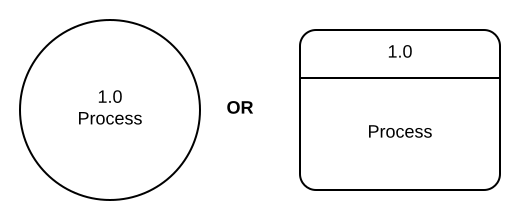
## Naming
- .red[Verb phrase] that describes the data transformation
- .red[Include process number]
]

---

# DFD Elements

.left-column[
## Data Store
- Place to hold data  
- Storage for a single process or transfer between processes  

## Examples
Files, Registry keys, Databases, Shared memory, Message Queue
]

--

.right-column[
## Representation
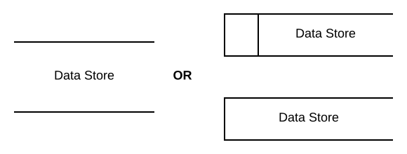
## Naming
- .red[Noun phrase], but plural
]

---

# DFD Elements

.left-column[
## Data Flow
- Flow of data between External Interactors, Processes and Data Stores  
- Contracts between DFD elements

## Examples
Cookie, Form data, Response page, Credentials, etc.
]

--

.right-column[
## Representation

## Naming
- .red[Noun phrase] that describes the application data being transferred
]

---

# DFD Elements

.left-column[
## Trust Boundary
- Intersects .red[data flows]
- Component on one side doesn't trust the one on the other side

## Examples  
- Data flows from one privilege level to another  
- External entities and processes with different trust levels
]

--

.right-column[
## Representation
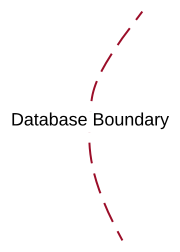
## Naming
- Describes the boundary placement
]

---
## DFD Example


---
# DFD Levels

## Levels are hierarchically related
### Based on the granularity of the processes
- .red[**Level 0:**] Single process represents the whole system  
Very high-level; entire component / product / system.  
Show how the system interacts with the outside world.
- .red[**Level 1:**] Major processes and data stores identified   
High level; single feature / scenario
- .red[**Level 2:**] Detailed subcomponents of processes  
Low level; detailed features of a single feature / scenario
- ...

---
class: middle

# DFD Construction

## Step 1
### Start with a Level 0 diagram for a use case
- Single process
- Identify all External Interactors
- Draw data flows to connect them
---
class: middle
# DFD Construction
## Step 2
### Transition to a Level 1 diagram
- Breakdown the single Level 0 process into major processes and related data stores
- Check your work
- Can you tell a story without edits?
- Does it match reality?

---
class: middle
# DFD Construction
## Step 3
### Add trust boundaries that intersect data flows
### Trust boundary placement
- Threads are often inside a trust boundary.   
They share the same privileges, rights, identifiers and access    


- Processes talking across a network may create a secure channel, but .red[they’re still distinct entities.]   
Encrypting network traffic is an ‘instinctive’ mitigation, but may not address tampering or spoofing


---
class: middle
# DFD Construction
## Step 4
### Iterate over processes and data stores
- Break them down if more detail needed to explain .red[_security impact of the design_]


- Break them down if an object crosses a trust boundary. For example, a remote procedural call (RPC)


- Break them down if you use words like “sometimes” and “also” in your story

---
class: middle
# DFD Construction
## Step 5: Check the diagram for sanity (1)
### Data stores
- Two data stores should not be connected with data flows directly. They are static entities.
- External interactors should not directly interact with data stores. Their data representation formats are different.
- Data stores should have an input flow
- Try to locate data sinks, whenever possible

### Data Flows
- Attached to at least one process


---
# DFD Construction
## Step 5: Check the diagram for sanity (2)
### External Interactors
- Avoid data flows between External Interactors. They cannot be observed by the system.
- Data always comes from External Interactors.

### Processes
- Avoid direct dataflows between two separate processes. Use intermediate data stores such as message queues or domain sockets.
---
# DFD Construction
## Step 6
### Simplify
- Consolidate data flows that always flow together


- All processes need appropriate _inputs_ to generate _outputs_. No outputs without inputs!


- Avoid partitioning processes based on control logic.  
Partition processes that perform multiple functions.


- DFDs do not typically show time dependencies.   
If processes can communicate directly they are assumed to be synchronous!
---
class: middle
# DFD Modeling Summary
- DFDs depict data flows from sources to sinks with transformations along the way.   
Trust boundaries intersecting these data flows.


- Hierarchical structuring (Levels) allows system analysis at different levels of abstraction

---
class: middle, center
# Threat Identification
DFDs allows potential threats to be .red[automatically generated]!

---

class: middle
# Microsoft STRIDE Threats

.left-column[
## Threat
- .red[S]poofing
- .red[T]ampering
- .red[R]epudiation
- .red[I]nformation Disclosure
- .red[D]enial of Service
- .red[E]levation of Privilege
]

---

class: middle
# Microsoft STRIDE Threats

## Spoofing
* A process or entity is something other than the claimed identity

## Tampering
* Act of altering bits

## Repudiation
* Deny that something happened or an action was taken

---
class: middle
# Microsoft STRIDE Threats

## Information Disclosure
* Information can be read by an unauthorized party

## Denial of Service
* Process or data store not able to process incoming requests

## Elevation of Privilege
* A user can increase capability or privilege by taking advantage of an implementation bug
---

# STRIDE with DFDs (Per Element)

Threats that a DFD element can cause to its connected elements or is subject to itself.

.left-column[
## External Interactor
- SR

## Process
- STRIDE
]

--

.right-column[
## Data Store
- TID, R (logs only)

## Data Flow
- TID
]
---
class: middle
# Practice

---
class: middle
# Practice (2)

---
class: middle
# Observations and Reflections

--
## Expensive (Time)
- Too many threats to analyze! (even for small diagrams)

## Redundancy
- Redundant threats when analyzed individually

--

## How can we make this more efficient?
---
class: middle
# STRIDE with DFDs (Per .red[Interaction])
## Focus on Interactions
- Interaction:   
A source and target element connected by a data flow
---
class: middle
# STRIDE with DFDs (Per .red[Interaction])
## Efficiencies and Savings
- For each interactions apply STRIDE
- For each STRIDE threat identify the attacker controlled element and the attacked element
- For data flows inside a .red[single] process space,   
don’t worry about T, I, or D
- Prioritize interactions that cross trust boundaries
???
## Significant reduction in number of threats to be analyzed
---
class: middle
# Trust boundaries
## Trusted/high code reading from untrusted/low
- Look for Tampering threats

## High code writing to low
- Errors may result in Information Disclosure
---
class: middle
# Avoid Distractions
## Applications can't do much here:
- The computer is infected with malware
- Someone removed the hard drive and tampers
- Admin is attacking user
- A user is attacking himself

--

## Applications can’t address any of these   
(unless you’re the OS)

---
class: middle
# Practice


#### How many interactions? How many are high priority?

---

class: middle
# Practice


#### How many interactions? How many are high priority?
---
class: middle
# Observations and Reflections

--

## Automation
- Much of this analysis can be automated using simple rules based on the diagram structure
- Tool support

## Traceability
- Would be nice to link all analysis along with the diagram
- A bit more than a PPT, Visio or Lucidchart!

---
class: middle
# [Microsoft TMT 2016](https://www.microsoft.com/en-us/download/details.aspx?id=49168)
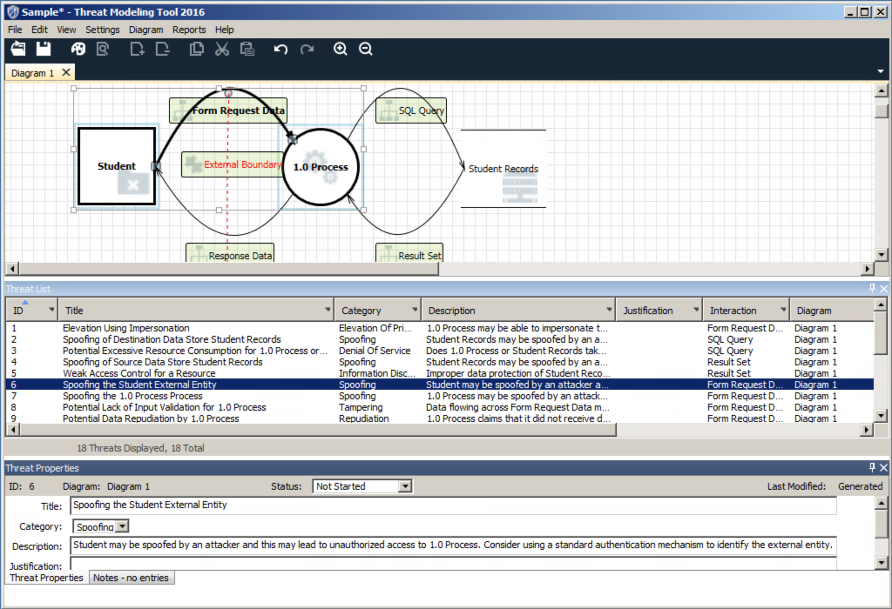
---
class: middle
# .center[Threat Mitigation]

.footnote[Why bother if you create a great model, identify lots of threats, and .red[stop!]]

---
class: middle
# Threat Mitigations
## Four ways to address each threat
1. Redesign to eliminate
1. Apply standard mitigations  
What have similar software packages done and how has that worked out for them?
1. Invent new mitigations (.red[risky!])
1. Accept vulnerability in design  
Risk acceptable, but must be verified and approved

---
class: middle
# STRIDE Controls

.left-column[
## Threat
- .red[S]poofing
- .red[T]ampering
- .red[R]epudiation
- .red[I]nformation Disclosure
- .red[D]enial of Service
- .red[E]levation of Privilege
]

.right-column[
## Control
- Authentication
- Integrity
- Nonrepudiation
- Confidentiality
- Availability
- Authorization
]
---

class: middle
# Standard Mitigations

## Spoofing
### Require authentication
- Data source
- Code integrity

### Validation of input read from the data source
- Normalization before neutralization
- Avoid recursion bombs

---
class: middle
# Standard Mitigations

## Tampering

### Integrity Checking
- Digital signatures and message authentication codes
- ACLs for data at rest

### Validation of input read from the data source
- Normalization before neutralization
- Avoid recursion bombs

---
class: middle
# Standard Mitigations

## Repudiation
- One-way log and audit generation mechanism
- Strong authentication for logging

## Information Disclosure
- ACLs
- Encryption with good key management and protocols
---
class: middle
# Standard Mitigations

## Denial or service
- ACLs to protect the contents of files from being removed or modified
- Firewall rules to protect against some network based attacks
- Use disk and processor quotas to prevent excess disk or CPU consumption

---
class: middle
# Standard Mitigations

## Elevation of Privilege
- Input validation
- Input validation
- Input validation
- ACLs, Roles, Groups
- Privilege dropping
- Least privilege

---
# How to ignore threats?
## No requirement
- There are no requirements that the &lt;&lt;element&gt;&gt; protect against &lt;&lt;STRIDE&gt;&gt; threat

## Irrelevant
- This threat does not exist, so we don't care about &lt;&lt;STRIDE&gt;&gt; threat to the &lt;&lt;element&gt;&gt;

## Not applicable
- &lt;&lt;STRIDE&gt;&gt; threat does not apply to this &lt;&lt;element&gt;&gt;
---
class: middle
# Validate the Threat Model

1. Do the threats consider misuse cases?
1. Does the diagram match final code?
1. Are threats enumerated? At minimum:
STRIDE per element that touches a trust boundary
1. Has Test / QA reviewed the model?
Testers often finds issues with threat model or details
1. Is each threat mitigated?
1. Are mitigations done right?  (Assurance case?)
---
class: middle
# Playsound API

"_The PlaySound API takes as input a string which represents either a WAV filename or an alias.  If the input is an alias, the PlaySound API retrieves data from the registry under HKCU to convert the alias into a filename.  Once the filename is determined, the PlaySound API opens the WAV file specified and reads the two relevant pieces from the file: the WAVEFORMATEX that defines the type of data in the file and the actual audio data.  It then hands that data to the audio rendering APIs._"

## Build a Threat Model based on this description

???

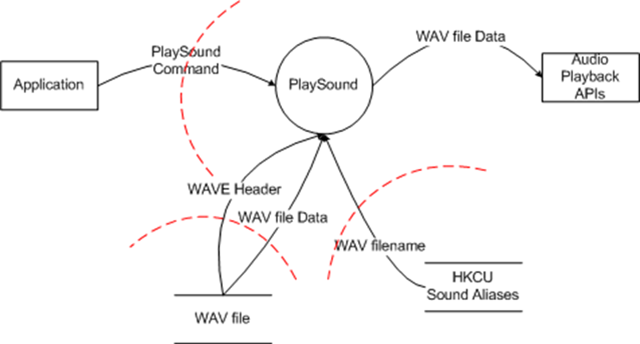  
http://blogs.msdn.com/b/larryosterman/archive/2007/09/13/threat-modeling-again-analyzing-the-threats-to-playsound.aspx

---
# Making this Fun

## Elevation of Privilege Card Game
- Ease developers into doing threat modeling
- [Card Game Introduction](https://www.microsoft.com/en-us/sdl/adopt/eop.aspx)
- [How to play](http://social.technet.microsoft.com/wiki/contents/articles/285.elevation-of-privilege-the-game.aspx)
- [Card Images](https://robinagandhi.github.io/swa/slides/lecture-4/images/eopcardcameimages.pdf)


---
class: middle
# More about threat modeling

## Blogs
- Microsoft Tutorial on [TMT 2014](http://blogs.microsoft.com/cybertrust/2014/04/15/introducing-microsoft-threat-modeling-tool-2014/  )
- Bruce Schneier on [threat modeling](http://www.schneier.com/blog/archives/2007/10/threat_modeling.html)

## Practice Diagrams
- Microsoft [Readings](https://msdn.microsoft.com/en-us/library/aa562036.aspx)

---
# Sources

- This presentation is borrows a lot from Microsoft training materials on threat modeling
- Many sources for Data flow diagrams
---

class: center, middle
# Threat Modeling Exercise

---
class: middle

# Step 1
- Download and install [TMT 2016](https://www.microsoft.com/en-us/download/details.aspx?id=49168)
- You may also directly access it on your machine at view.unomaha.edu

---

class: middle
# Step 2
## Recall the misuse case assignment
- You identified several use cases to include misuse cases.

---
class: middle
# Step 3
## Elaborate the Misuse cases using Threat models
- Develop Level 1 DFDs that supports each of your use cases.
- Perform analysis on your code base to align the diagram with reality
- Draw the DFDs in TMT 2016
- Identify appropriate trust boundaries on the diagram
- Validate the diagram for any obvious structural deficiencies

---
class: middle
# Step 4
## Analyze the Level 1 diagram to identify the applicable STRIDE threats
- Examine each threat automatically identified
- Document mitigation strategies for the identified threats
- Pay special attention for elements that interact across threat boundaries
- Generate a full HTML report using TMT 2016
- Host the reports on your project github repo.
- Review OSS project actual software design for security related issues based on your threat models. Summarize your observations.

---
# Grading criteria

### Use of proper notations
- DFD notation

### Threat Model Quality
- Threat model focuses on critical components of interest
- Proper wording of the model elements
- Clean, coherent and valid DFD diagram

### Threat Mitigation Quality
- Quality of analysis to mitigate threats

---
class: middle
# Due Date
Wednesday November 8th, 2017
# Structural	Patterns	for	

# Security	Engineering


# Distrustful	Decomposition


# Distrustful	Decomposition

- **Name**
    - Distrustful	Decomposition
- **Intent/Solution**
    - Move	 **_separate	functions	needing	different	privilege	_**
       **_levels	_** into	 **_mutually	untrusting	components_**
    - Reduce	functionality	and	data	exposed	to	an	
       attacker	if	one	of	the	mutually	untrusting	components	
       is	compromised	
- **Also	Known	As	**
    - Privilege	reduction	


# Distrustful	Decomposition

- **Applicability**
    - A	process	performs	more	than	one	
       high-level	function	
       But,	various	functions	of	the	system	require	
       different	privilege	levels.	
       So,	the	process	is	forced	to	run	at	the	highest	
       privilege	level	required	among	all	the	function!


# Distrustful	Decomposition

- **Structure**
    - Decompose	the	system	up	into	two	or	more	
       programs	that	run	as	separate	processes	that:
          - Potentially	have	different	privileges	
          - Perform	a	small,	well-defined	sub-function
          - Uses	inter-process	communication to	talk	to	other	
             processes.	E.g.	RPC,	sockets,	SOAP	or	shared	files
          - Are	 **mutually	untrusting**


# Distrustful	Decomposition

- **Structure**

```
The trust boundaries enforce mutually untrusting behavior between the
Frontend Process and the Authorization Process
```

# Distrustful	Decomposition

- **Consequences**
    - Compartmentalization	of	faults
       - prevents	an	attacker	from	compromising	an	entire	
          system	in	the	event	that	a	single	component	program	is	
          successfully	exploited	because	no	other	program	trusts	
          the	results	from	the	compromised	one
    - Easier	system	maintenance
    - Communication	overhead/slowdown
    - Protect	inter-process	communication	channels	
       from	tampering/disclosure/dos


# Distrustful	Decomposition

- **Implementation**
    - Each	program	runs	in	its	own	process	space	with	
       potentially	separate	user	privileges
    - Communication	between	separate	programs	is	
       either	one-way	or	two-way
          - One-way:	fork()/exec()(UNIX),	CreateProcess()
             (Windows)	is	used	to	transfer	control	
          - Two-way:	RPC,	sockets,	SOAP,	shared	files
    - No	component	places	any	inherent	trust in	the	
       contents	of	the	inter-process	communication


# Sendmail

**This is a single process
that runs as root!** 75


# Q-mail	(secure)


# q-mail

- qmail	ensures	that	local	mail	delivery	is	secure	by	

### breaking	it	into	two	processes:

- qmail-lspawn	and	qmail-local
- qmail-lspawn	runs	as	the	super-user
- Short	(less	than	500	lines)	and	simple
    - Looks	up	the	target	user	to	find	the	uid,	then	it	runs	qmail-
       local	after	becoming	that	user.	It	does	not	write	any	files,	nor	
       does	it	read	any	files	once	it	decides	on	its	new	uid.	


# Distrustful	Decomposition

- Known	Use
    - Qmail design
- Must	read	Papers

```
http://www.nrg4u.com/qmail/the-big-qmail-picture- 103 - a4.pdf 78
```
```
http://hillside.net/plop/
4/papers/mhafiz1/PLoP
04_mhafiz1_0.pdf
https://cr.yp.to/qmail/qmails
ec-20071101.pdf
```

# Privilege	Separation


# Privilege	Separation

- Intent/Solution
    - Reduce	the	“ **_amount	of	exposed	code_** ”	that	runs	
       with	special/high	privilege	without	affecting	or	
       limiting	the	functionality	of	the	program
    - Run	exposed	system	interfaces	as	limited	privilege	
       clients	(slave)	to	high	privilege	system	services	
       (monitor)	with	defined	information	requests	only	


# Privilege	Separation

- Applicability:
    - Useful	for	system	services	that	must	authenticate	
       users	and	then	allow	the	users	to	run	interactive	
       programs	with	normal,	user-level	privileges
    - Also	be	useful	in	general	for	authenticating	
       services


# !!	Vulnerable	Design	!!


# Privilege	Separation

- Implementation
    - Create	a	privileged	server.	Initial	user	requests	will	be	
       directed	to	this	server.	
    - When	a	user	request	arrives	at	the	server
       - The	server	will	spawn	off	an	untrusted,	unprivileged	child	to	
          handle	the	user	interaction	required	during	authentication
       - The	root	directory	of	the	child	process	is	set	to	an	
          unimportant,	empty	directory	or	a	jail	
    - After	the	user	has	been	authenticated,	the	server	will	
       spawn	off	another	child	process	with	the	appropriate	
       UID	to	actually	handle	the	user’s	request.	


# Privilege	Separation

[http://www.citi.umich.edu/u/provos/ssh/privsep.html](http://www.citi.umich.edu/u/provos/ssh/privsep.html)^84


# Privilege	Separation

[http://www.citi.umich.edu/u/provos/papers/privsep.pdf](http://www.citi.umich.edu/u/provos/papers/privsep.pdf)^85


# Privilege	Separation

- Consequences
    - An	adversary	who	gains	control	over	the	child	
       - is	confined	in	its	protection	domain	and	
          does	not	gain	control	over	the	parent	
       - does	not	gain	control	of	a	process	possessing	elevated	privileges,	
          thereby	limiting	the	damage	that	the	adversary	can	inflict	
    - Additional	verification,	such	as	code	reviews,	additional	
       testing,	and	formal	verification	techniques,	can	be	focused	
       on	code	that	is	executed	with	special	privilege,	which	can	
       further	reduce	the	incidence	of	privilege	escalation.	
    - System	administration	overhead	(unprivileged	user	IDs)


# Privsep.c Threat	Model

- **Structure**


# Summary	for	Interaction	Level	

# Structural	Patterns


# Modular	with	Mutual	Suspicion

- Components	should	not	trust	other	

## components	

- Trust	but	verify
- Each	component	in	an	interacting	pair	should	

## always	be	prepared	to	protect	itself	against	an	

## attack	from	the	other

- Perform	a	small,	well-defined	function
    - Separation	of	 _function_ and	 _privilege	levels_


# Least	privilege

- Separate	functions	that	require	different	

## privilege	levels

- Minimize	privilege	levels	in	components	

## exposed	to	users	or	network	connections

- Communicate	using	defined	messages	

## between	slave	client	and	privileged	server


# Compartmentalization

- Can	be	achieved	using:
    - Different	processes	spaces	with	different	user	
       accounts	and	privilege	sets
    - Empty	root	directories	of	child	process
    - Containers	or	Virtual	machines
    - Structured	Encapsulation	(Ring	architecture)
    - Sandboxing
    - Access	control


# Implementation	Level	

# Patterns


# Input	Validator

- Three	categories	of	input	 _handling_
    - Integrity	checks:	ensure	data	has	not	been	tampered	
       with	(requires	digital	signatures	and	hashing)
    - Validation:	a	set	of	rules	for
       - Data	is	of	a	certain	type
       - Has	correct	syntax,	canonicalized
       - Within	specified	length	boundaries
       - Contains	only	permitted	characters
    - Business	rules:
       - Checks	that	enforce	business	logic
          - Disallowing	due-dates	already	passed	when	paying	bills


# Structure


# Consequences

- Prevents	attacks	in	message	content
- Whitelisting	wards	off	unknown	attacks
- Accounting	of	attacks	by	capturing	rule	

## violations

- Centralized	mechanism	
- Reusable	solution,	but	do	not	reuse	

## implementation


# Secure	Logger

- Problem
    - Logs	can	leak	sensitive	system	information
    - Allow	attackers	to	hide	their	action	if	the	logs	can	
       be	edited
- Solution
    - Use	a	secure	logging	system	that	handles	and	
       stores	log	data


# Secure	Logger

- Structure
    - **Application:** generates	logging	data
    - **Secure	Logger:	** responsible	for	storing	
       the	logging	information	in	a	manner	
       that	makes	it	difficult	or	impossible	for	
       an	unauthorized	user	to	access	the	
       logging	data.Runs	in	a	separate	
       process
    - **Log	Reader:** a	reading	mechanism	
       specific	to	the	secure	logging	system
    - **Log	Viewer:	** An	authorized	user	may	
       read	the	log	data	using	some	sort	of	
       log-viewing	application.	


# Secure	Logger

- Consequences
    - Logs	provide	accountability	and	forensics	
       capabilities
    - Need	to	protect	log	files	(Compartmentalize)
    - Need	to	maintain	separate	logging	privileges
       - Prevents	covert	channels	and	improves	confidence	
          in	accountability
- Also	known	as:
    - Accountability	and	Traceability	


# Path	Name	Canonicalization

- Intent/Solution:
    - All	files	read	or	written	by	a	program	are	referred	
       to	by	a	valid	path	that	does	not	contain	any	
       symbolic	links	or	shortcuts,	i.e.	a	canonical	path	
    - Call	OS	specific	canonicalization	routines	before	
       performing	analysis	on	the	path	name
    - https://www.securecoding.cert.org/confluence/display/cplusplus/FIO02-
       CPP.+Canonicalize+path+names+originating+from+untrusted+sources


# Secure	Directory

- Intent/Solution:
    - File	operations	should	be	performed	in	a	 _secure	_
       _directory_ .	
          - Secure	Directory:	A	directory	in	which	no	one	other	
             than	the	user,	or	possibly	the	administrator,	has	the	
             ability	to	create,	rename,	delete,	or	otherwise	
             manipulate	files
    - https://www.securecoding.cert.org/confluence/display/c/FIO15-
       C.+Ensure+that+file+operations+are+performed+in+a+secure+directory


# Secure	Assertion

- Intent/Solution:
    - Disseminate	security	assumption	checks	
       throughout	the	application	to	continually	monitor	
       the	program	for	correct	behavior	and	detect	
       evidence	of	attack/misuse
    - Self-checks,	Self-analysis
       - e.g.		
          Begin: Critical Function
             {
                assert authorizationFlag == True
                dosomething....
             }
             [http://docs.oracle.com/javase/7/docs/technotes/guides/language/assert.html](http://docs.oracle.com/javase/7/docs/technotes/guides/language/assert.html) 101


# Deter/Slowdown

- Intent/Solution
    - Slow	password	hashing	functions	(PBKDF2,	bcrypt)
    - Account	lockout
       - Protects	accounts	from	automated	password-guessing	
          (known	username)	or	username	guessing	(known	password)	
          attacks,	by	implementing	a	limit	on	incorrect	attempts	
          before	further	attempts	are	disallowed
       - Time	limited	lockout	prevents	DoSattack


# Clear	Sensitive	Information

- Intent/Solution:
    - Sensitive	information	stored	in	a	reusable	
       resource	may	be	accessed	by	an	unauthorized	
       user	if	the	sensitive	information	is	not	cleared	
       before	freeing	the	reusable	resource
- Applicability:
    - Application	stores	sensitive	information	in	a	
       reusable	resource	


# Clear	Sensitive	Information

- Structure


# Deception

- Intent/Solution
    - Make	it	difficult	for	an	attacker	to	discern	the	
       internal	workings	of	an	application
          - Hide	all	error	messages	to	generic	one
          - Use	appropriate	compiler	flags
          - Remove	debugging	capabilities,	and	comments	in	
             generated	code
    - Trick,	detect,	and	block	attackers	during	a	
       break-in	attempt
    - Aggressively	introduce	variations	that	aid	
       in	detection	of	an	attacker 105


# Questions?


# Patterns	Sources

- Dougherty,	Chad	et	al.	 _Secure	Design	Patterns._ CMU/SEI- 2009 - TR-010.	
    Software	Engineering	Institute,	Carnegie	Mellon	University.	2009.	
    [http://resources.sei.cmu.edu/library/asset-view.cfm?AssetID=9115](http://resources.sei.cmu.edu/library/asset-view.cfm?AssetID=9115)
- High-Assurance	Design:	Architecting	Secure	and	Reliable	Enterprise	
    Applications	by	Clifford	J.	Berg **.ISBN-13:	** 978 - 0321793270.
    [http://amzn.com/0321793277](http://amzn.com/0321793277)


class: center, middle
# .red[Coding] for Software Security Engineering

---
# Good Code
.right-column[

]
---
class: middle
# What to .red[avoid]?
## Enumerations and Dictionaries
- Common Weakness Enumeration
- Common Attack Pattern Enumeration and Classification
- Common Vulnerabilities and Exposures
- Coding Guidelines

???
An enumeration is a complete, ordered listing of all the items in a collection. The term is commonly used in mathematics and computer science to refer to a listing of all of the elements of a set. [Source Wikipedia]

---

class: middle
# Building Abstractions

## .orange[Weaknesses]\* span a range of languages, products and environments
- Enumeration is appropriate

## .red[Vulnerabilities]\* in code are language, product or environment specific
- Dictionary is appropriate

.footnote[
\* Relationships between a [vulnerability](https://cwe.mitre.org/documents/glossary/#Vulnerability) and [weakness](https://cwe.mitre.org/documents/glossary/#Weakness)
]

---
class: middle

## Building Abstractions for .orange[Weaknesses]
Examine commonalities and differences in mistakes

--

### Leads to useful analysis
- Which class of mistakes to address first?
- What are the related mistakes in an attack vector?
- What are the known/reusable mitigations?

---

class: middle
# Learning from .red[mistakes]

## Landwehr Software Flaw Taxonomy (1993)
- Genesis, Location, Time of introduction

--

## More recent efforts...
- Seven Pernicious Kingdoms, PLOVER, 19 Deadly Sins, OWASP top ten, WASP, etc,.

--

## Common Weaknesses Enumeration [(CWE)](http://cwe.mitre.org)
- Assimilates and advances categorization efforts

---


---

class: middle
# CWE purpose
## Measurement
- Unified, .red[measurable] set of software weaknesses

## Communication
- Effective .red[sharing], description, selection, and use of software security tools and services

## Prioritization
- .red[Ranking] of software weaknesses related to design and code

---

class: middle
# CWE organization


---
# CWE Types
### Weakness Class: e.g. [CWE-20](https://cwe.mitre.org/data/definitions/20.html)
- Abstract, independent of any specific language or technology

### Weakness Base: e.g. [CWE-79](https://cwe.mitre.org/data/definitions/79.html)
- Abstract, sufficient details to infer specific methods for detection and prevention

### Weakness Variant: e.g. [CWE-85](https://cwe.mitre.org/data/definitions/85.html)
- Detailed, limited to a specific language or technology.

### Weakness Category: e.g. [CWE-990](https://cwe.mitre.org/data/definitions/990.html)
- A set of other entries that share a common characteristic

---

# Finding the best CWE

## [Mapping Guidance](https://cwe.mitre.org/documents/cwe_usage/mapping_navigation.html)
- Map to a Weakness only
- .red[DO NOT] map to Categories or Views
- Map at the lowest abstraction level possible

## Search resources
- [Full text search](https://cwe.mitre.org/find/index.html)
- [Full listing](https://cwe.mitre.org/data/definitions/2000.html)
- Navigating views: [CWE-1000](https://cwe.mitre.org/data/definitions/1000.html), [CWE-699](https://cwe.mitre.org/data/definitions/699.html), [CWE-888](https://cwe.mitre.org/data/definitions/888.html)  
Turn on .blue[_Show Details_] option
- For a CWE page, turn on .blue[_Mapping-Friendly_] option.  
Then navigate to parent, child, peer relationships

---

class: middle

# Exercise
## Map [CVE-2004-0492](https://nvd.nist.gov/vuln/detail/CVE-2004-0492) to CWEs
- Description:   
Heap-based buffer overflow in proxy_util.c for mod_proxy in Apache 1.3.25 to 1.3.31 allows remote attackers to cause a denial of service (process crash) and possibly execute arbitrary code via a negative Content-Length HTTP header field, which causes a large amount of data to be copied.  
- Build a list of most relevant CWE IDs. Example: .red[79 35 34]

--

## Submit Response
- [Poll](http://PollEv.com/robingandhi)

???
# http://PollEv.com/robingandhi

---
<iframe src="https://embed.polleverywhere.com/free_text_polls/pKUP1ssJBP39qFC?controls=none&short_poll=true" width="100%" height="100%" frameBorder="0"></iframe>

---
class: middle
# Some CWEs to Remember
- [CWE-120](https://cwe.mitre.org/data/definitions/120.html): Classic buffer overflow
- [CWE-798](https://cwe.mitre.org/data/definitions/798.html): Use of hardcoded credentials
- [CWE-311](https://cwe.mitre.org/data/definitions/311.html): Missing encryption
- [CWE-434](https://cwe.mitre.org/data/definitions/434.html): Unrestricted upload of file with dangerous type
- [CWE-250](https://cwe.mitre.org/data/definitions/250.html): Execution with unnecessary privileges
- [CWE-494](https://cwe.mitre.org/data/definitions/494.html): Download of code without integrity check
- [CWE-22](https://cwe.mitre.org/data/definitions/22.html):  Path traversal
- [CWE-759](https://cwe.mitre.org/data/definitions/759.html): Use of one-way hash without a salt

## CWE Compatibility
- [CWE Compatibility and Effectiveness Program](http://cwe.mitre.org/compatible/index.html)

---

class: middle
# CWE Prioritization
## [Technical Impacts](https://cwe.mitre.org/cwss/cwss_v1.0.1.html#2.3.1) of [Weaknesses](https://cwe.mitre.org/cwraf/ti_scorecard.html)
1. Read data  
1. Modify data  
1. Denial-of-Service: unreliable execution  
1. Denial-of-Service: resource consumption  
1. Execute unauthorized code or commands  
1. Gain privileges / assume identity  
1. Bypass protection mechanism  
1. Hide activities  

## Top CWE lists
- [CWE/SANS Top 25](https://cwe.mitre.org/top25/index.html)
- Scoring mechanisms: [CWSS](https://cwe.mitre.org/cwss/index.html), [CWRAF](https://cwe.mitre.org/cwraf/index.html)

???
The technical impacts help focus on the set of weaknesses that contribute to the negative technical impact of relevance in a given context. This helps to filter and prioritize a set of weaknesses.

---

class: middle

# Attack Patterns

---

class: middle
# Common Attack Pattern Enumeration and Classification

## Enumerates .red[attack patterns] used in exploits
- Total of 550+ attack patterns
- Abstractions:   
Meta, Standard, Detailed Patterns and Categories

## CAPEC:  
- Patterns:  
[CAPEC-242](https://capec.mitre.org/data/definitions/242.html), [CAPEC-63](https://capec.mitre.org/data/definitions/63.html), [CAPEC-86](https://capec.mitre.org/data/definitions/86.html), [CAPEC-245](https://capec.mitre.org/data/definitions/245.html)    
- Views:    
[CAPEC 1000](https://capec.mitre.org/data/definitions/1000.html), [CAPEC-3000](https://capec.mitre.org/data/definitions/3000.html)

---
class: middle

# Vulnerabilities

---

class: middle
# Common Vulnerabilities and Exposures (CVE)

## One name for a vulnerability
- Akin to a .red[\#hashtag] to track all discussions and reports related to a [vulnerability in different databases](http://cve.mitre.org/about/)


---
class: middle

# [National Vulnerability Database](http://nvd.nist.gov)
- Maintains a dictionary of CVEs
- CVEs use Common Platform Enumeration (CPE) to identify affected products and packages. [Search Engine](https://nvd.nist.gov/vuln/search)
- Total CVEs: 80000+, ~15-20 added every day

---

# Visual Recap
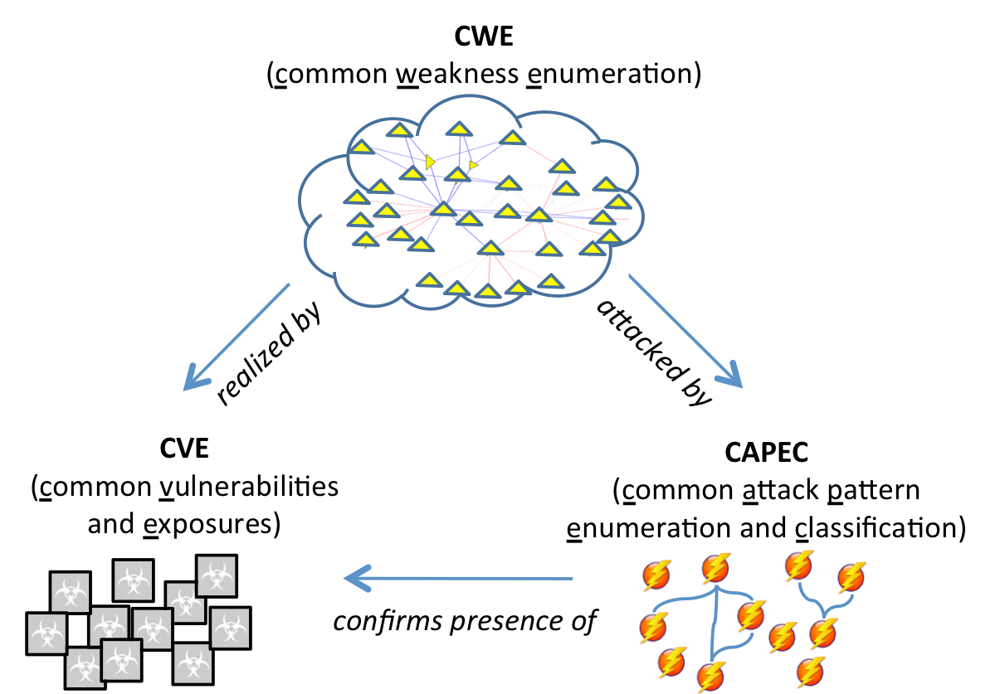

---
class: middle
# Secure Coding Guidelines

---
class: middle
# CERT Secure Coding Guidelines
- Normative requirements (aka. coding standards) for programming languages
- [C, C++, Java, Perl, and the Android platform](https://www.securecoding.cert.org)
- Software development and software security communities
- Violation does not mean vulnerability but a weakness


## Rules
- [DCL30-C](https://www.securecoding.cert.org/confluence/display/c/DCL30-C.+Declare+objects+with+appropriate+storage+durations), [MEM30-C](https://www.securecoding.cert.org/confluence/display/c/MEM30-C.+Do+not+access+freed+memory)

## Other resources
- [Secure Programs HowTo](http://www.dwheeler.com/secure-programs/Secure-Programs-HOWTO.html#LANGUAGE-SPECIFIC)

---
# Rejoicing Project Managers!
### Johnny, avoid these weaknesses!
- CWE

### Johnny...these are the ways of the bad guys
- CAPEC

### Johnny...learn from your mistakes
- CVE

### Johnny...follow secure coding guidelines
- Secure coding guidelines
.top-right[

]
---
class: middle
# Why Johnny Can't Write Secure Code?
---
class: middle
## Poor Johnny!
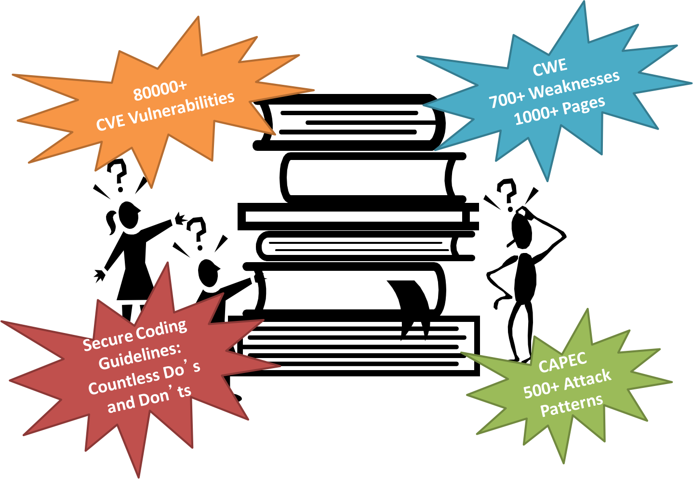

---
class: middle
## Training Surgeons


---
class: middle
## Paradox we Face!


---
class: middle
# Reducing the Cognitive Overload

## When the Devil is in the Details...
- The details to consider for avoiding weaknesses are enormous during the coding phases

## ...simple, intuitive guides are need
---
class: middle
# Key Questions for a Weakness
### What are the .blue[Software flaws] (omission, commission, operational) that lead to the weakness?
### What are the defining characteristics of the .orange[Weakness]?
### What are the .green[Resources/Location] where the weakness is typically manifest?
### What are the .red[Consequences] that the weakness precedes?

---
# Do CWEs answer them?
### CWE-119: Failure to Constrain Operations within the Bounds of a Memory Buffer
- The software performs operations on a memory buffer, but it can read from or write to a memory location that is outside of the intended boundary of the buffer.
- Certain languages allow direct addressing of memory locations and do not automatically ensure that these locations are valid for the memory buffer that is being referenced. This can cause read or write operations to be performed on memory locations that may be associated with other variables, data structures, or internal program data. As a result, an attacker may be able to execute arbitrary code, alter the intended control flow, read sensitive information, or cause the system to crash.

---
# Do CWEs answer them?
### CWE-119: .orange[Failure to Constrain Operations within the Bounds of a] .green[Memory Buffer]
- .orange[The software performs operations on a] .green[memory buffer].orange[, but it can read from or write to a memory location that is outside of the intended boundary of the] .green[buffer].
- Certain languages allow direct addressing of memory locations and .blue[do not automatically ensure that these locations are valid for the memory buffer that is being referenced.] .orange[This can cause read or write operations to be performed on memory locations that may be associated with other variables, data structures, or internal program data.] .red[As a result, an attacker may be able to execute arbitrary code, alter the intended control flow, read sensitive information, or cause the system to crash.]

---
# Untangling


---
# Full Extraction

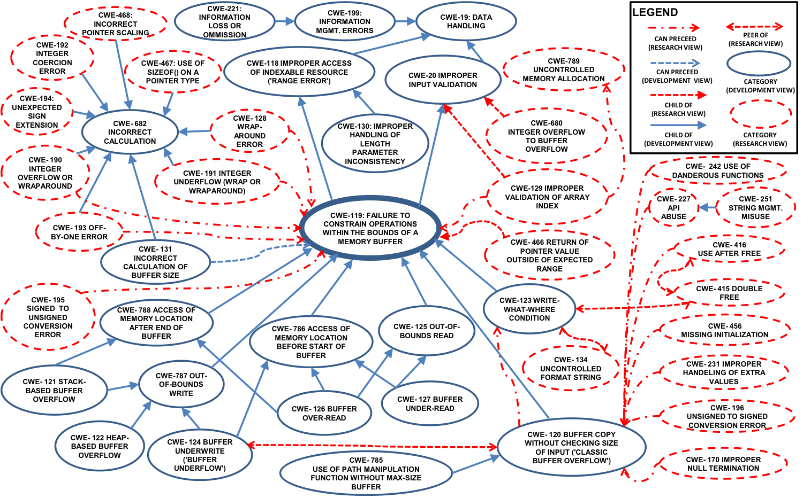

---
# Buffer Overflow Template
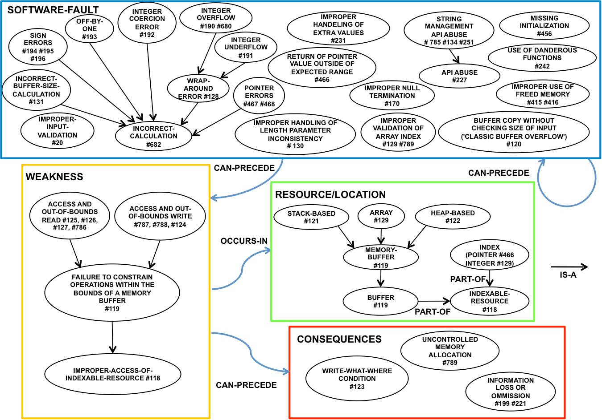

---
class: middle
# Putting the pieces together


---
class: middle
# CVE-2004-0492
- NVD Description:   
.green[Heap-based] .orange[buffer overflow] in proxy_util.c for mod_proxy in Apache 1.3.25 to 1.3.31 .red[allows remote attackers to cause a denial of service (process crash) and possibly execute arbitrary code] via a .blue[negative Content-Length HTTP header field], which .red[causes a large amount of data to be copied.]  

---

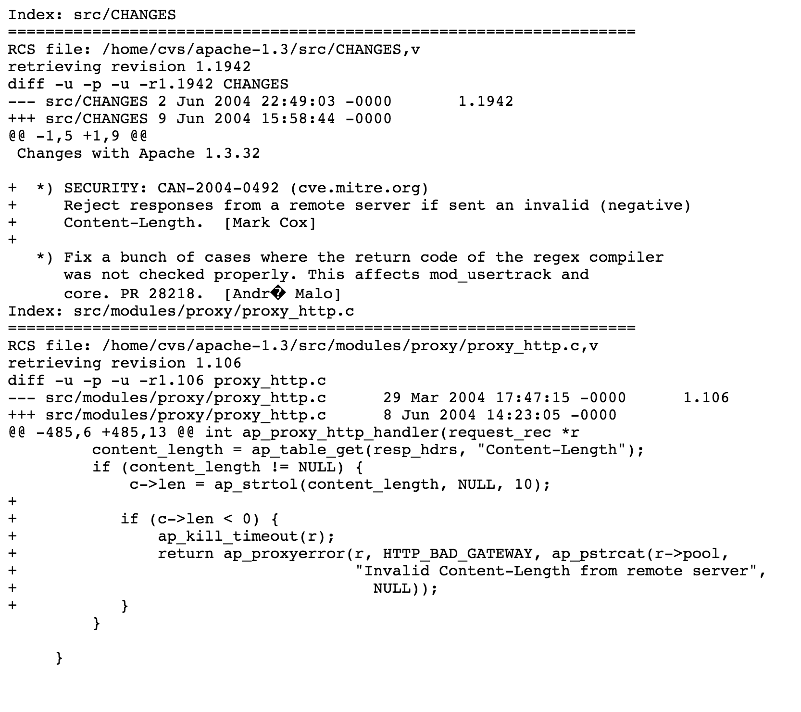

---
#### **Buffer Overflow Semantic Template CVE-2004-0492**

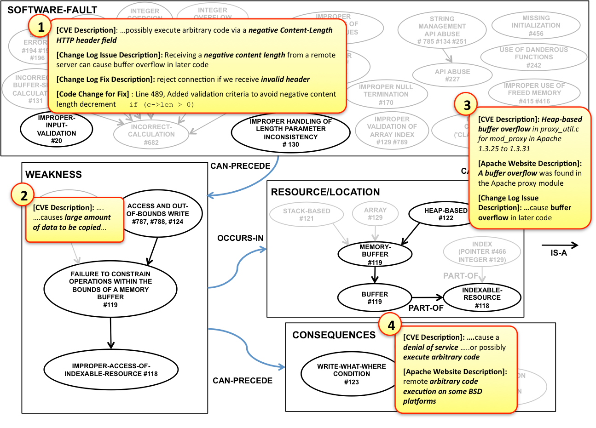

---


---
# Buffer Overflow Secure Coding Assessment


---

#### Injection template

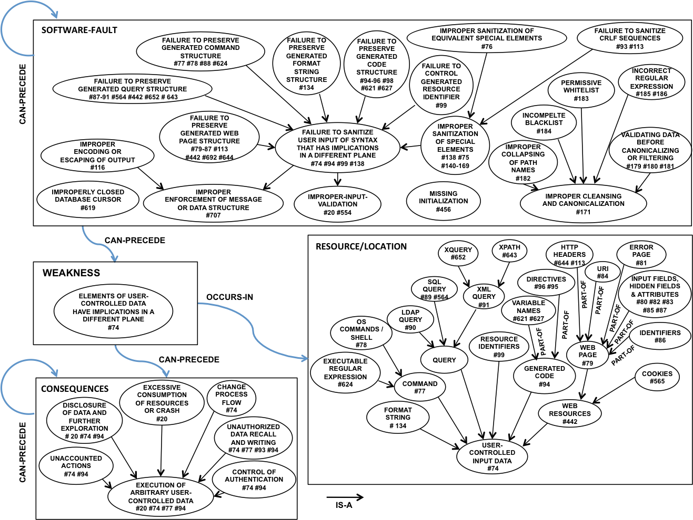

---
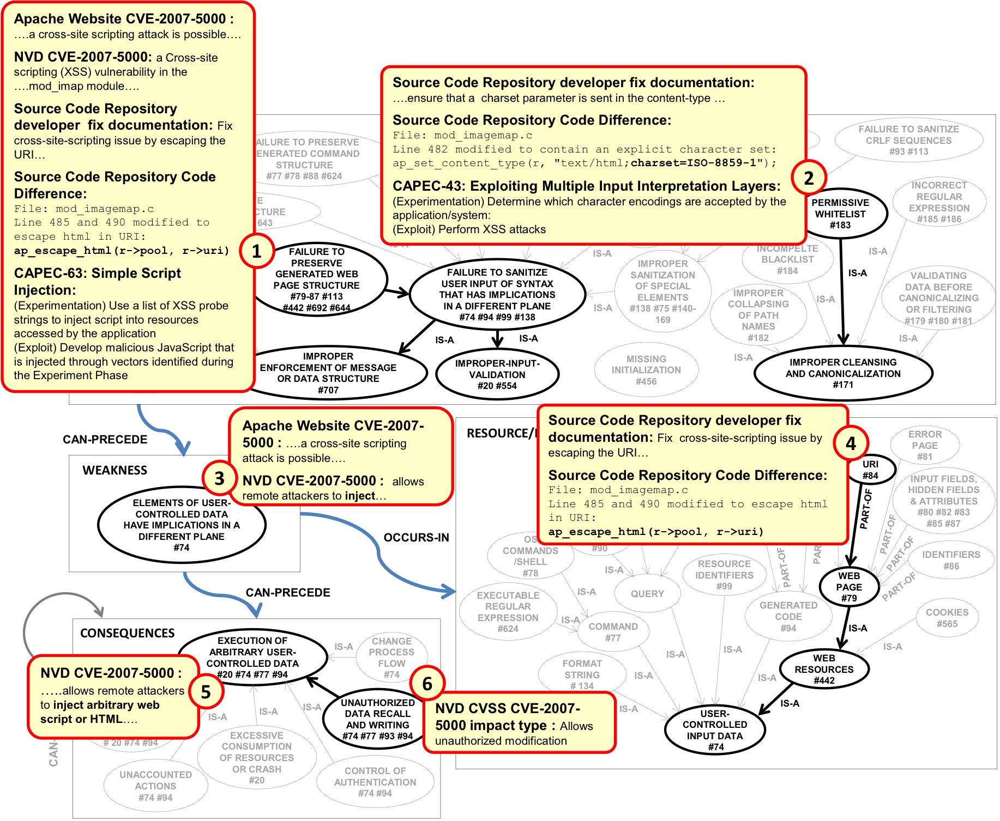

---

# Some take aways...
## Ask Johnny (or your software vendor):
### What CWEs do the vulnerabilities in your project typically map to? Have you taken any hands-on training for them?

--
### Have you looked at the [semantic templates](http://faculty.ist.unomaha.edu/rgandhi/st) by being developed at UNO?
### Here are some [example vulnerabilities](http://faculty.ist.unomaha.edu/rgandhi/st/CVEsamples.zip), why don’t you fill-up the semantic templates to study them?

---

class: middle
# Use/mentions of Semantic Templates

## NIST Bug Framework (BF)
https://samate.nist.gov/BF/
https://samate.nist.gov/BF/Enlightenment/ST.html

## CWE Acknowledgement
http://cwe.mitre.org/about/process.html#follow_on_opportunities

---
class: middle
# Acknowledgements
## This research is partially funded by
### DoD/AFOSR, NSF FA9550-07-1-0499, .blue[High Assurance Software] and
### NIST 70NANB12H013, .blue[Developing Precise and Accurate Descriptions of Common Software Weaknesses]
