class: center, middle
# Software Assurance
---

class: center, middle

???
Fixing software bugs presents a high-cost when software is already in production. Imagine fixing/replacing a lego block that is embedded deep within your structure!
---
class: center, middle

???
We have now come to tolerate bugs in software. The "business as usual" culture at its best.
---
class: center, middle

???
As organizations struggle with the quality/cost of in-house software development, outsourcing does not rid of the responsibilities. In fact, expressing expectations and assessing becomes even more important!
---
class: center, middle

???
As we explore this course topic, it helps to know about recent day software failures. Each one of these send organizations scrambling for testing and applying patches in their environments.

2014 Sandworm used a zero day exploit in all version of Microsoft Windows. The vulnerability exists in PACKAGER.DLL, which is a part of Windows Object Linking and Embedding (OLE) property. By using a crafted PowerPoint document, an .INF file in embedded OLE object can be copied from a remote SMB share folder and installed on the system. Attackers can exploit this logic defect to execute another malware, downloaded via the same means. [Source: http://blog.trendmicro.com/trendlabs-security-intelligence/an-analysis-of-windows-zero-day-vulnerability-cve-2014-4114-aka-sandworm/]

CVE: https://web.nvd.nist.gov/view/vuln/detail?vulnId=CVE-2014-4114
CWE: Improper Input Validation (CWE-20)
---
class: center, middle

???
2014 Heartbleed in the OpenSSL library was really a wake-up call for organizations using poor management practices for software acquisition and inventory. Many organizations started paying attention to open source software risk management after this incident. This bug involved a buffer length check issue that allowed an attacker to read all memory contents including SSL\TLS keys used for encryption. At the time, none of the open source or proprietary static or dynamic analysis tools
could discover this vulnerability.
CWE-130: Improper Handling of Length Parameter Inconsistency

---
class: center, middle

???
# Shellshock or Bashdoor
A issue in the bash shell that allowed arbitrary commands to be executed when the commands are concatenated to the end of function definitions stored in the values of environment variables. Within days of the publication of this, intense scrutiny of the underlying design flaws discovered a variety of related vulnerabilities, (CVE-2014-6277, CVE-2014-6278, CVE-2014-7169, CVE-2014-7186, and CVE-2014-7187).
---
class: center, middle

???
The GHOST vulnerability is a serious weakness in the Linux glibc library. It allows attackers to remotely take complete control of the victim system without having any prior knowledge of system credentials. CVE-2015-0235 has been assigned to this issue.
---
class: center, middle

???
## Badlock
Badlock bug in Windows and Samba revealed that the vulnerability was no blockbuster after all, but rather a widespread--and not critical-- vulnerability that can be abused in man-in-the-middle attacks in file server environments.

An attacker could intercept a user’s credentials and steal or modify files, or wage a denial-of-service attack, but he or she would have to be on the same network as the victim, security experts say.
---
class: center, middle
# [#gotofail](https://www.imperialviolet.org/2014/02/22/applebug.html)
???
# Apple SSL/TLS bug
Two goto fail lines in a row. The first one is correctly bound to the if statement but the second, despite the indentation, isn't conditional at all. The code will always jump to the end from that second goto, err will contain a successful value because the SHA1 update operation was successful and so the signature verification will never fail.

---
class: center, middle
# [Quadrooter](https://www.defcon.org/html/defcon-24/dc-24-speakers.html#Donenfeld)
???
* 2016
4 flaws in android discovered by a checkpoint researchers.
Challenge faced with fixing the Quadrooter flaws:
"Qualcomm has a significant position in the development chain, in that a phone maker isn't taking the Android open-source code directly from Google, they're actually taking it from Qualcomm,"
http://www.zdnet.com/article/quadrooter-security-flaws-affect-over-900-million-android-phones/

https://web.nvd.nist.gov/view/vuln/detail?vulnId=CVE-2016-2503

---
class: center, middle
## What % is FUD and Marketing?

---
## [Security Concerns in 2016](http://www.csoonline.com/article/3013107/security/forecast-2016-security-takes-center-stage.html)

???
# 2016 Predictions

---
class: middle
# [Top Security Concerns in 2017](http://www.csoonline.com/article/3199937/security/top-5-infosec-concerns-for-2017.html)

## Based on Searches on CSOonline
- Network Security
- Networking
- Windows OS (ransomware related)
- OS security
- Active Directory
???
# 2017 Predictions
---

class: left, middle
## .blue[Most discussions of IT security focus on IT infrastructure and process, stopping short of security considerations related to the design and implementation of the application itself...]

.footnote[
Brian Morgan, CTO, Skyline Technologies
]
???
This is an interesting observation. The security community is too busy dealing with fixing things from outside and dealing with the problem after it already is a serious problem. The predictions are almost about the things that the vendors can solve and can currently address. The latter part is the hard problem.

The software engineering community is too busy inventing solutions to build more and more complex pieces of software faster and cheaper.

---
class: center, middle
# Right questions to ask?

???
Story time:  
[Source: http://cacm.acm.org/magazines/2009/6/28488-answering-the-wrong-questions-is-no-answer/fulltext]  
Two buddies leaving a tavern find a distressed and somewhat inebriated man on his hands and knees in the parking  lot, apparently searching for something.
They ask him what he has lost, and he replies that he has dropped his keys. He describes the keys, and says if the two men find them they will receive a
reward. They begin to help search. Other people come by and they too are drawn into the search. Soon, there is a crowd combing the lot, with an air of competition
to see who will be the first to find the keys. Periodically someone informs the crowd of the discovery of a coin or a particularly interesting piece of rock.
After a while, one in the crowd stands up and inquires of the fellow who lost his keys, “Say, are you sure you lost your keys out here in the lot?” To which the
man replies, “No. I lost them in the alley.”  Everyone stops to stare at the man. “Well, why the heck are you searching
for them here in the parking lot!?” someone exclaimed. To which the man replied, “Well, the light is so much better
here. And besides, now I have such good company!”

if we don’t properly define the problem, ask the right questions, and search in the proper places, they may have
good company and funding, but they shouldn’t expect to find what they are really seeking.

So it is in research—especially in cyber security and privacy. We have people seeking answers to the wrong
questions, often because that is where “the light is better” and there seems to be a bigger crowd around them. Until
we start asking questions that better address the problems that really need to be solved, we shouldn’t expect to
see progress. Here are a few examples of misleading questions:

* How do I secure my general purpose software against all threats?

* How do I protect my system with an intrusion-detection system, data
loss and prevention tools, firewalls, and other techniques?

* How do I find coding flaws in the system I am using so I can patch them?

Each of these questions implies it can be answered in a positive, meaningful way.
That is not necessarily the case.
We have generally failed to understand that when we build and deploy
systems they are used in a variety of environments, facing different threats.
There is no perfect security in any real system—hardware fails, people make
mistakes, and attacks outside our expectations may defeat our protection
mechanisms. If an attacker is sufficiently motivated and has enough resources
(including time), every system can be defeated in some manner.
If the attacker doesn’t care if the defeat is noticed, it may reduce the work factor
involved; as an obvious example, an assured denial-of-service attack can
be accomplished with enough nuclear weapons.

The goal in the practice of security is to construct sufficient defenses against the likely threats

---
class: center, middle

---
class: center, middle
# What is Software Assurance?
---
# NASA Definition
## The planned and systematic set of activities that ensures that .red[software processes and products] conform to requirements, standards, and procedures.
.red[Processes]: include all of the activities involved in designing, developing, enhancing, and maintaining software    

.red[Products]: include the software, associated data, its documentation, and all supporting and reporting paperwork  
???
* The theme is organizational in nature and emphasizes a well thought-out set of activities to achieve compliance with organizational best practices, requirements standards and procedures.
* Process (a complete cradle to grave  approach for the software lifecycle)
* Products (this amounts to all the software artifacts produced
* NASA stays away from the word security because both security and safety are covered under the umbrella of their software assurance effort and goal is correctness !

---
# Committee on National Security Systems (CNSS)
## The level of confidence that .red[software] is free from .red[_vulnerabilities_], regardless of whether they are .red[intentionally] designed into the software or accidentally inserted later in its life cycle, and that the software functions in the intended manner.
???
- This understanding of software assurance is consistent with the use of the term in connection with information, i.e., information assurance (IA).
- A more technical definition which focuses on software flaws, intention, and time of introduction.  
- __lost the focus on engineering!__

---

.footnote[
.red[NSA Center for Assured Software]
]
???
NSA Center for Assured Software was stood up in 2005
* They focus on **exploitable** vulnerabilities only. Much more refined scope.
* NSA does not develop software, they only test it. So no emphasis on engineering here as well.

* Design analysis, however, is done before any code analysis.
* The "n+1" vulnerability problem. You will never be able to hire enough blackhat hackers, if the foundational design and engineering effort is missing.
---
# DHS
## A planned and systematic set of multidisciplinary activities must be applied to ensure the conformance of both .green[software and processes] to requirements, standards, and procedures
.red[Trustworthiness]: the absence of .green[exploitable vulnerabilities] whether maliciously or unintentionally inserted  

.red[Predictable execution]: provides .red[justifiable confidence] that the software, when executed, will function as intended
???
DHS definition is a medely of all prior definitions with a focus on engineering, vulnerabilities and justifiable confidence for a complex system property
---
# Academics
## Secure software cannot be intentionally .red[subverted or forced to fail]
The software that remains .red[correct] and predictable in spite of intentional efforts to compromise .red[dependability]
???
Leave it to academics to use big words!
---
# Software Engineering Institute

Application of .green[technologies and processes] to achieve a required level of .blue[confidence\*] that software systems and .red[services] function in the intended manner, are free from accidental or intentional vulnerabilities, provide .red[security capabilities appropriate to the threat environment], and .red[recover from intrusions and failures].

.footnote[
\*The use of the word .blue[confidence] implies that there is a .red[basis for the belief] that software systems and services function in the intended manner
]
---
# Dr. Gandhi's Version
## .red[Basis for the belief] that software will operate as expected in its .red[threat environment]
.red[Resist] most attacks  

.red[Tolerate] as many as possible of those attacks it cannot resist  

.red[Contain] the damage and recover to a normal level of operation as soon as possible  
???
Highlights:
* The focus of the definition is on Assurance: Providing the _Basis for the Belief_
* Software behavior is tied to it threat environment (avoid making general statements about secure software)
* Account for known attacks
* Acknowledge unknown attacks and plan for them.
* Recover from failures --> This is "resiliency"
# This is an outcome of Software Security Engineering
---

# Software Weakness

## A type of .red[mistake] in software that, in proper conditions, could contribute to the introduction of vulnerabilities within that software.
Weakness are any mistakes in implementation, design, or other phases of the software development lifecycle.
--

## .red[Basis for belief] increases if engineering evidence is available for _reducing_ weaknesses

---
class: center, middle
# Software Security Engineering*
The .red[Engineering Challenge] is now established.   
Next &mdash; How do we go about it?   

.footnote[
\*it is not the same as Security Software Engineering
]

???
A new term is introduced here to further clarify __Software Assurance__. This terms is better than saying _secure software_. The term security engineering reflects the intent that software has been developed and tested to operate as intended in its operational environment.
---
class: left, middle
## Probably the most serious risk in system software is incomplete design, in the sense that .red[inadvertent loopholes] exist in the protective barriers and have not been .red[foreseen by the designers].
.footnote[
The Ware Report, __1969__
]
???
Are these concerns fresh? think again!
---
class: left, middle
## The technical problem to be solved is that of determining .red[what constitutes an appropriate defense against malicious attack], and then developing hardware and software with the defensive mechanisms .red[built-in].
.footnote[
The Anderson Report, __1972__
]
???
Are these concerns fresh? think again!
---
class: center
# Course Goals
## .red[Internalize]
security engineering during the software development lifecycle
## .green[Assure]
through evidence-based beliefs
## .blue[Experience]
software security engineering by engaging in hand-on activities with Open Source Software
???
## [Internalize](https://www.google.com/#q=define+internalize)
security engineering during the software development lifecycle
## [Assure](https://www.google.com/#q=assure)
through evidence-based security
## [Experience](https://www.google.com/#q=experience)
security engineering by engaging in hand-on activities with  
Open Source Software
---
class: center
# Course Methods
## Process Agnostic
Analysis applicable in any [lifecycle](https://en.wikipedia.org/wiki/Software_development_process) [.blue[strategy]](https://en.wikipedia.org/wiki/Rational_Unified_Process)  
## Lightweight
Share and [institutionalize](https://www.google.com/search?q=intitutaionalize) knowledge  
## Practical
Methods currently used in [software engineering practice](https://www.bsimm.com/framework/)

???
## Process Agnostic
Analysis applicable in any [lifecycle strategy](https://en.wikipedia.org/wiki/Software_development_process)  
_Waterfall, Spiral, UML, Agile, etc._
## Lightweight
Share and [institutionalize](https://www.google.com/search?q=institutionalize) knowledge  
_Relevant and logically analyzable documentation_
## Practical
Methods currently used in software engineering practice  
_e.g., [Microsoft SDL](https://www.microsoft.com/en-us/sdl/), [BSIMM](https://www.bsimm.com/framework/), [SEI Curricula](http://www.cert.org/curricula/software-assurance-curriculum.cfm?)_
---

# Security .red[vs.] Safety, Reliability and Quality

## Common
Software works as expected despite the presence of certain internal and external stimuli, influences, and circumstances
--

## Different for Security
* The nature of external stimuli, influences, and circumstances:   
.red[An Intelligent, persistent adversary]
---
class: center, middle
# A Winning Strategy

---
class: center, middle
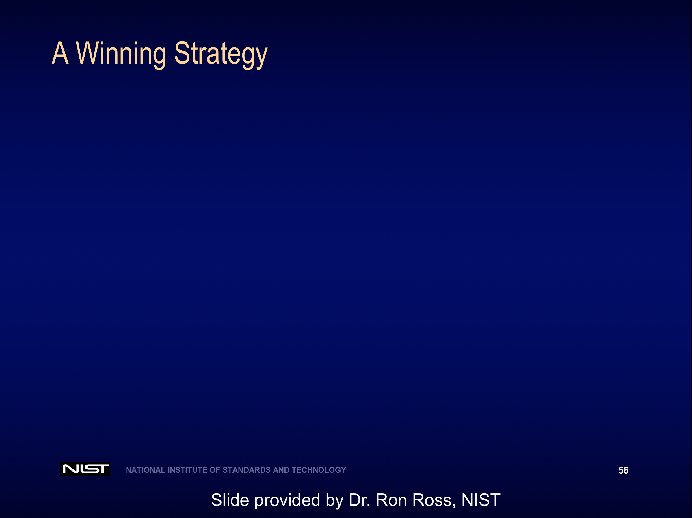
---
class: center, middle

---
class: center, middle
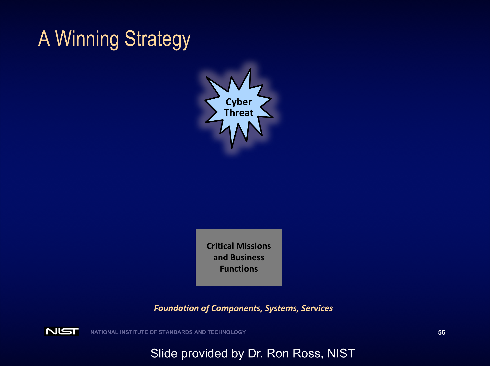
---
class: center, middle

---
class: center, middle
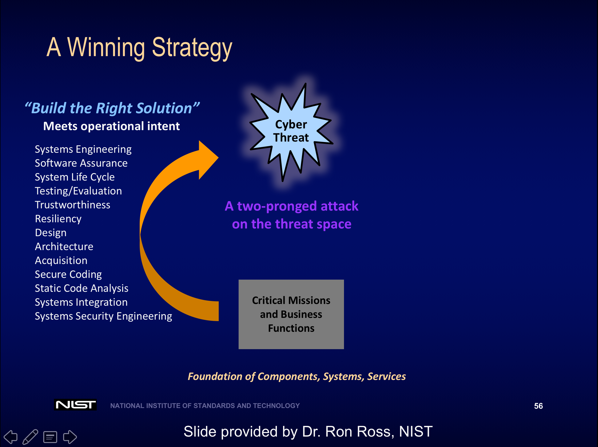
---
class: center, middle
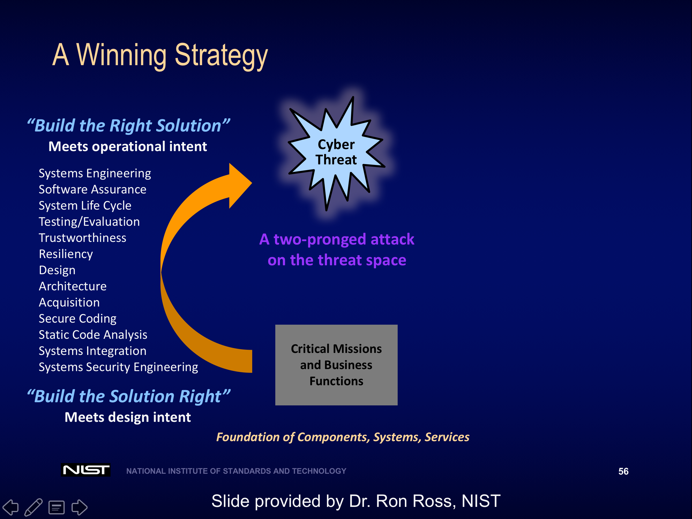
---
class: center, middle

---
class: center, middle

---
class: center, middle
# Are you ready for it?
.footnote[
[Rugged manifesto](https://www.ruggedsoftware.org/)
]
---
class: center, middle
## “_This whole economic boom in cybersecurity seems largely to be a consequence of .red[poor engineering]._”  
.footnote[
Carl Landwehr, CACM, February **2015**
]
---
class: center, middle
# Discussion?

---
class: center, middle
# Next up...
## Engineering for Assurance
class: center, middle
# Systems Security Engineering*

.footnote[
\*Based on Chapter 2 of [NIST SP 800-160 Systems Security Engineering](http://nvlpubs.nist.gov/nistpubs/SpecialPublications/NIST.SP.800-160.pdf)  
which expands on [ISO/IEC/IEEE 15288:2015
Systems and software engineering](http://www.iso.org/iso/catalogue_detail?csnumber=63711)
]

???
Appendices to NIST SP 800-160 are going to be added soon.
https://beta.csrc.nist.gov/News/2016/NIST-Special-Publication-800-160,-Systems-Secu-%281%29

---

class: center, middle

???
Systems security engineering is hard. Particularly, when you have a well-resourced and capable adversary.

---

# Agenda

1. Need for Security Engineering  

1. Terminology  

1. Security Engineering Perspective  

1. Security Engineering Framework

---

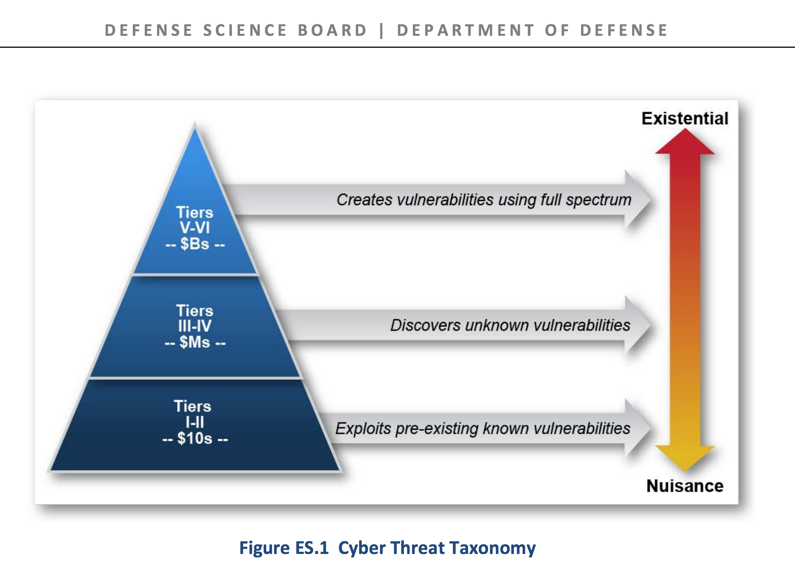
.footnote[
\*[Defense Science Board 2013 Report](http://www.acq.osd.mil/dsb/reports/2010s/ResilientMilitarySystemsCyberThreat.pdf)
]

???

# Report Terminology

## Cyber
broadly used to address the components and systems that provide all digital information, including weapons/battle management systems, IT systems, hardware, processors, and software operating systems and applications, both standalone and embedded.

## Resilience
defined as the ability to provide acceptable operations despite disruption: natural or man-made, inadvertent or deliberate.

## Existential Cyber Attack
defined as an attack that is capable of causing sufficient wide scale
damage for the government potentially to lose control of the country, including loss or damage to significant portions of military and critical infrastructure: power generation, communications, fuel and transportation, emergency services, financial services, etc.

The Task Force developed a threat hierarchy to describe capabilities of potential attackers, organized by level of skills and breadth of available resources
- Tiers I and II attackers primarily exploit known vulnerabilities
- Tiers III and IV attackers are better funded and have a level of expertise and sophistication sufficient to discover new vulnerabilities in systems and to exploit them
- Tiers V and VI attackers can invest large amounts of money (billions) and time (years) to actually create vulnerabilities in systems, including systems that are otherwise strongly protected.

Higher-tier competitors will use all capabilities available to them to attack a system but will usually try lower-tier exploits first before exposing their most advanced capabilities. Tier V and VI level capabilities are today limited to just a few countries such as the *United States, China and Russia*.

---

# Need for Security Engineering
## Vulnerabilities within organizations
- Known vulnerabilities
- .red[Unknown] vulnerabilities
- .red[Adversary-created] vulnerabilities

--

## Visible Vulnerabilities
- Discovery and patching

--

## Invisible Vulnerabilities
- Sound security engineering

???

2013 Defense Science Board Task Force described several tiers of vulnerabilities within organizations including known vulnerabilities, unknown vulnerabilities, and adversary-created vulnerabilities. The important and sobering message conveyed by the Defense Science Board is that the top two tiers of vulnerabilities (i.e., the unknown vulnerabilities and adversary-created vulnerabilities) are, for the most part, totally invisible to most organizations. These vulnerabilities can be effectively addressed by sound systems security engineering techniques, methodologies, processes, and practices—in essence, providing the necessary trustworthiness to withstand and survive well-resourced, sophisticated cyber-attacks on the systems supporting critical missions and business operations.

---
class: center, middle

.footnote[
\*.red[above the waterline] and .red[below the waterline] problems
]

???

If we think of an iceberg, the visible vulnerabilities are above the waterline and the invisible ones are the ones below. It is the invisible ones that are difficult to address and can potentially sink the ship!

We will refer to "above the waterline" and "below the waterline" problems

---
class: center, middle
# Systems Engineering View
.top-right[
    
]

---

# Terminology

## System
Combination of interacting .red[elements] organized to achieve stated purposes

--

## System Element
Recursively defined as a .red[system]  
Member of a set of elements that constitute a system  

_Examples: hardware; .red[software]; firmware; data; facilities; materials; humans; processes; and procedures_

???
# System and System Element
* The recursive definition of a system element allows us to support the notion of a system of systems.  
* The term **system** may apply to a collection of elements or a single element
* One observer's system may be another observer’s system element.  

---

# Terminology

## System-of-Interest
System that is the focus of the .red[engineering] effort

## Enabling System
System that supports a .red[system‐of‐interest] during its life cycle stages but does not necessarily contribute directly to its function during operation  

_Examples: code compilers, assemblers, prototypes, test harness, unit tests_

???
# System of Interest
* The term system-of-interest is used to define the set of system elements, system element interconnections, and the environment that it operates in.

---

# Terminology

## Other Systems
System that interacts with the .red[system‐of‐interest] in its operational environment

_Examples: a global positioning system space vehicle being an “other system” interacting with a GPS receiver as the “system‐of‐interest.”_

---

class: center, middle
  
Systems Engineering View

???
# Things to note:
* The system of interest identification scopes the set of system elements, system element interconnections, and the environment that it operates in
* All _other systems_ that interact with the system of interest are included in the operational environment
* Some enabling systems may exist outside the environment of operation, for example, the compiler used at the developer site, open source developer

# Can you think of _other systems_ that introduce risk?
# Can you think of _enabling systems_ that introduce risk?

---

class: center, middle
# Security Engineering Perspective

---
# Security Engineering Perspective

## .red[Security]
Freedom from conditions that can cause _loss of assets_ with _unacceptable consequences_
--

## .red[Engineering challenge]
Engineer _protection capabilities_ for:
1. .red[assets] to which security applies and
1. .red[consequences] against which security is assessed

???

# Conditions
These can be adversity in the form of disruptions, hazards, and threats and are considered synonyms for “bad things that happen” that are of interest to systems security engineering

# Consequence
[ISO/IEC 15026-1]
Effect (change or non-change), usually associated with an event or condition or with the system and usually allowed, facilitated, caused, prevented, changed, or contributed to by the event, condition, or system.

---

# Security Engineering Perspective

## Goal: _have .red[protection capabilities] built-in..._
--

### .red[Active Protections]
* .red[Mechanisms] that exhibit security behavior with functional and performance properties to satisfy security requirements

--

### .red[Passive Protections]
* Provides the environment for the .red[execution] and .red[construction] of all mechanisms (general purpose and security)

???

# Active Protection:
These mechanisms explicitly satisfy security requirements that address the behavior, interaction and utilization of and among technology/machine, environment, human, and physical system elements.

# Passive Protections:
For example, developer training in secure coding provides for the construction of security mechanisms with a higher level of assurance. Similarly, a fully patched and hardened java runtime environment provides a protection capability to the hosted java applications. A visual studio complier with the appropriate compiler flags is also a passive protection.

---

# Protection Examples

## Active Protections

- Access control
- Single sign-on
- Identification
- Authentication
- Encryption at rest and in transit
- Configurations
- Backup
- Two-phase commit
- Filters/Wrappers
- Validators
- ...

---

# Protection Examples

## Passive Protections

- Architecture
- Design
- Coding guidelines
- Code review
- Developer and user training
- Verified and configured compilers
- Acquisition policies
- Red-teaming
- Project management
- Runtime environments
- ...

---

# Adequate Security

## A well-reasoned sum of both active and passive protections
--

### For all .red[system execution modes]
e.g., initialization, operation, maintenance, training, shutdown
--

### For all .red[system states]   
e.g., secure, nonsecure, normal, degraded, recovery
--

### For all .red[transitions]
Between system states and between system execution modes.

???

For Rugged Software, **gradation** is important and hence reflected in our definition of _adequate security_.

---
class: middle, center
# Security Engineering Framework

---
# Framework

### .red[Problem] Context
A sufficiently complete understanding of the problem
--

### .red[Solution] Context
Transforms the security requirements into design requirements for the system
--

### .red[Trustworthiness] Context
Evidence-based demonstration, through reasoning, that the system-of-interest is deemed trustworthy

???
The framework is independent of system type and engineering or acquisition process model and is not to be interpreted as a sequence of flows or process steps but rather as a set of interacting contexts, each with its own checks and balances

---
class: center, middle
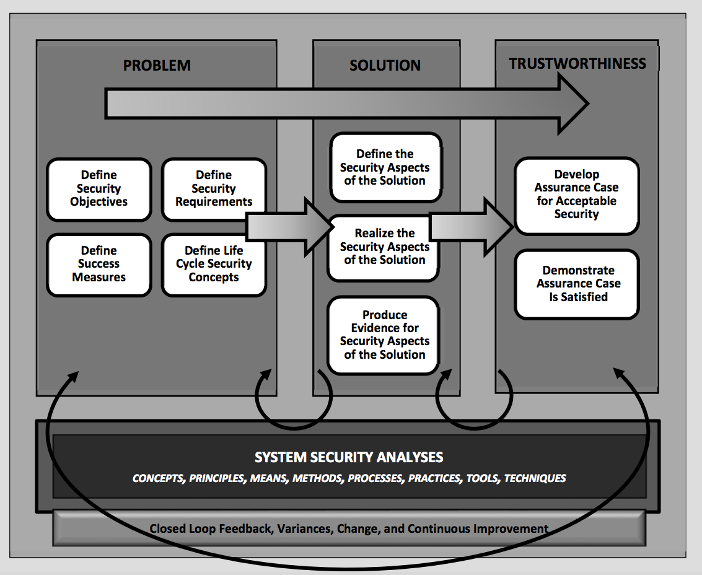  
???

???
Figure source: [NIST SP 800-160 Systems Security Engineering &mdash; Public Draft 2](http://csrc.nist.gov/publications/drafts/800-160/sp800_160_second-draft.pdf)

# Systems Security Engineering Framework
Establishing problem, solution, and trustworthiness contexts as key components of a systems security engineering framework ensures that the security of a system is based on achieving a sufficiently complete understanding of the problem as defined by a set of stakeholder security objectives, security concerns, protection needs, and security requirements. This understanding is essential in order to develop effective security solutions &mdash; that is, a system that is sufficiently trustworthy and adequately secure to protect stakeholder’s assets in terms of loss and the associated consequences.

# System security analyses

Employ concepts, principles, means, methods, processes, practices, tools, and techniques from the security perspective to provide relevant data and technical interpretations of issues from the security perspective

Support gradation:  
\* Differentiated to align with the scope and objectives of where they are applied within the systems security engineering framework

\* Performed with a level of fidelity, rigor, and formality to produce data with a level of confidence that matches the assurance required by the stakeholders and engineering team

---

# Problem Context (1/2)
## .red[Security objectives]
What it means to be _adequately_ secure for the assets and the consequences of asset loss against which security will be assessed
--

## .red[Measures of success]
Strength of protection and level of assurance in the engineered protection capability

???

# Security Objectives
This is where you start to think of your mission/business processes. What assets are important and the consequences of asset loss against which security will be assessed.

# Security Objectives and Measures of Success
The security objectives have associated measures of success. The two combine to drive the development of security requirements and the development of assurance claims

---
# Problem Context (2/2)

## .red[Life cycle security concepts]
Distinct contexts for interpretation of security and the associated processes, methods, and procedures

???
# Life cycle security concepts
- Concept
- Development
- Production
- Utilization
- Support
- Retirement

--

## .red[Security requirements]
Specifies the functional, assurance, and strength characteristics for a protection mechanism

???

# Example of Security Requirements:
- Access Control as a functional requirement  
- Secure coding standards as an assurance requirement  
- Rigor in enforcement and granularity of access control is a strength characteristic  
- Rigor in the coding standard and its security relevance is a strength characteristic  

---

# Solution Context

### .red[Define security aspects of the solution]:
- The security architecture views and viewpoints
- The security design
- Security performance verification measures

### .red[Realize security aspects of the solution]:
- Implementation of the system security design

### .red[Evidence for security aspects of the solution]:
- Analysis, demonstration, inspection, and test

---

# Trustworthiness Context

### .red[Developing and maintaining the assurance case]
- Assurance cases are developed for claims based on the security objectives and associated measures of success

### .red[Demonstrating that the assurance case is satisfied]
- An assurance case is a well- defined and structured set of arguments and a body of evidence showing that a system satisfies specific claims with respect to a given quality attribute

???
Assurance cases also provide reasoned, auditable artifacts that support the contention that a claim or set of claims is satisfied, including systematic argumentation and its underlying evidence and explicit assumptions that support the claims [ISO/IEC 15026-2]

---

class: center, middle
  
???
Figure source: [NIST SP 800-160 Systems Security Engineering &mdash; Public Draft 2](http://csrc.nist.gov/publications/drafts/800-160/sp800_160_second-draft.pdf)

---

class:center, middle
# Next Up
Constructing Assurance Cases using Goal Structuring Notation

TODO: Create a [Lucidchart Account](https://www.lucidchart.com) using your `.edu` email

---

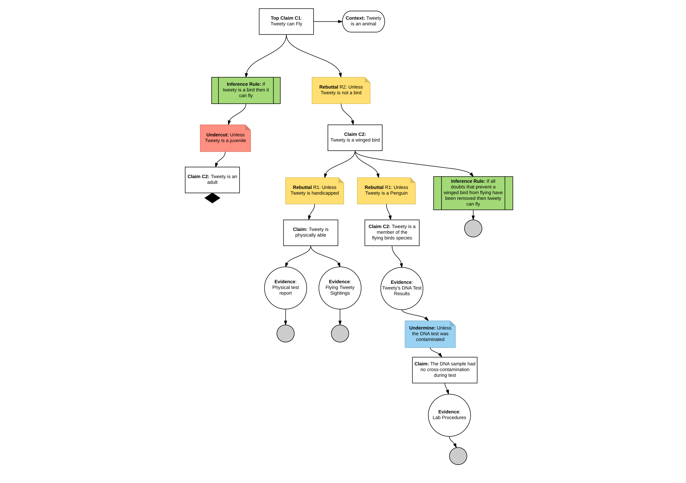
???
Source: This example is based on the presentation of this paper given at ICSE conference: J. B. Goodenough, C. B. Weinstock and A. Z. Klein, "Eliminative induction: A basis for arguing system confidence," 2013 35th International Conference on Software Engineering (ICSE), San Francisco, CA, 2013, pp. 1161-1164.
---
class: center, middle
# Systems Engineering Lifecycle Processes

---

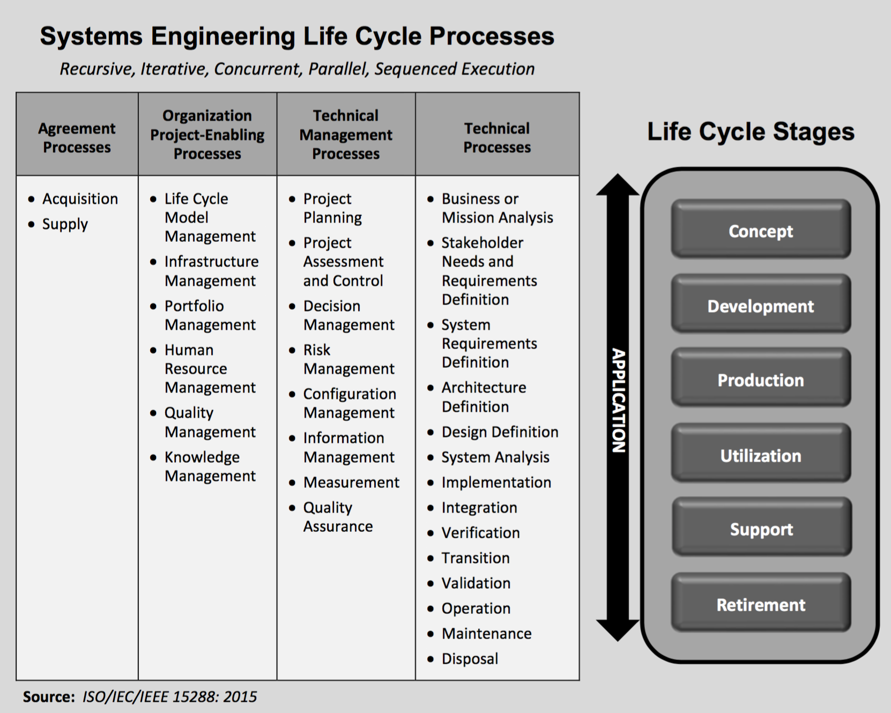
???
Figure source: [NIST SP 800-160 Systems Security Engineering](http://nvlpubs.nist.gov/nistpubs/SpecialPublications/NIST.SP.800-160.pdf)  
class: center, middle
# Assurance Case*
.footnote[
\* See notes for sources
]
???
This slide deck is based several sources as follows:

1. Goal Structuring Notation
2. [IEEE Standard— Adoption of ISO/IEC 15026-2:2011](https://www.iso.org/standard/52926.html)
Systems and Software Engineering— Systems and Software Assurance— Part 2: Assurance Case
3. Research papers on Eliminative Induction use in Assurance Cases
4. SEI publications on Assurance case use in Safety Cases

---
class: middle

## The first principle is that you must not fool yourself and you are the easiest person to fool... After you've not fooled yourself, it's easy not to fool other scientists.

.footnote[
Richard P. Feynman
]
.top-right[

]
---
class: middle

## .blue[Schneier's Law]  
## Any person can invent a security system so clever that he or she can’t imagine a way of breaking it.

.footnote[
Bruce Schneier
]
.top-right[

]
---
class: middle

## False assurance is a danger that is avoidable by only trusting technology that is demonstrably trustworthy.

.footnote[
Roger Schell
]
.top-right[

]
---
background-image: url(http://wallpapercraze.com/images/wallpapers/uwp6%20%282%29-110045.jpeg)
???
Scenario: Our goal is to find a black cat in a dark room.
---
background-image: url(images/black.png)

???
We also not sure if there is a cat there to begin with!
## Source:   
The cat example is adapted from the example provided in System Assurance: Beyond Detecting Vulnerabilities (The MK/OMG Press) 1st Edition, by Nikolai Mansourov  and Djenana Campara https://amzn.com/0123814146
---
class:middle
# Task at hand
Find a **black cat** in a **dark room**  
--

Also, we are not sure that the cat is really there!

--

## .blue[
What are the Goals/Claims to be proven?
]

---
class:middle
# Possible claims

## .red[Claim 1:] The room has at least one black cat
--

## .red[Claim 2:] The room has no black cats

--
## .blue[
What is the basis for the belief in these claims?
]
---
class: middle
# .red[Claim 1]
The room has at least one black cat

---
class: middle
# Basis for the Belief

## .blue[Kitty-Kitty-Kitty] Search Process*
1. Search team puts a bowl of milk in the room and says _kitty-kitty-kitty_ three times
1. Four corners and center of room covered
1. Stop when a cat is discovered

.footnote[\* Patent Pending]

---
# Structured Argument
### .red[Claim]
.red[C1:] The room has at least one black cat
--

### .red[Sub-Claims]
.red[C1.1:] Kitty-kitty-kitty search process discovers cats in the room

--

### .red[Evidence]

.red[E1.1.1:] Pictures of cats found

---
class: middle
# .red[Claim 2]
The room has .red[no] black cats

--

### .red[Sub-Claims]
.red[C1.1:] Kitty-kitty-kitty search process discovers no cats

--
### .red[Evidence]

.red[E1.1.1:] Empty findings report

---
class: middle
# Is this argument enough?
Can you ever be 100% sure for a large and complex room?  

---
class: middle
# .red[Assurance]
Basis for the belief in a claim

--

## .green[Belief] increases when .red[doubts] are removed!   

--

A good argument eliminates identified doubts

---

class: middle
# [Eliminative Induction](https://www.google.com/search?q=define+eliminative+induction)
A series of doubts are introduced for some state of affairs,  
and then progressively eliminated by new evidence

---
# Eliminative Induction

## Step 1: Introducing doubts
Challenge the identified claims by introducing doubts
--

## Step 2: Eliminate doubts
For each doubt, identify sub-claims that eliminate the doubt
--

## Step 3: Repeat
Go to Step 1, repeat process for sub-claims
---
class: middle
# Step 1: Introducing doubts

.red[C1.1:] Kitty-kitty-kitty search process discovers no cats
--

* .red[R1.1.1] _Unless_ the cats were not hungry  
* .red[R1.1.2] _Unless_ milk is not put in enough places
* .red[R1.1.3] _Unless_ the people searching are not competent
* .red[R1.1.4] _Unless_ the baby panthers found are indeed cats

---
class: middle
# Step 2: Eliminate doubts

.red[R1.1.1] Unless the cats were not hungry   
* .green[C1.1.1] The room was locked for 5 days  

--

.red[R1.1.2] Unless milk is not put in enough places  
* .green[C1.1.2] The room is simultaneously searched in 10 equal non-overlapping squares  

---
class: middle
# Step 3: Repeat --> Step 1: Identify doubts

.green[C1.1.1] The room was locked for 5 days  
* .red[R1.1.1.1] Unless the room vents allow cats to go in and out  

--

.green[C1.1.2] The room is simultaneously searched in 10 equal non-overlapping squares  
* .red[R1.1.1.2] Unless the cats have an alternate food supply (mice in the room)

---
class: middle
# Step 2: Eliminate doubts

.red[R1.1.1.1] Unless the room vents allow cats to go in and out  
* .green[C1.1.1.1.1] All room vents have nets installed

--

.red[Unless] the cats have an alternate food supply (mice in the room)
* .green[C1.1.1.1.2] There are no mice in the room

---
class: middle
# Stopping condition?

## Evidence
When the argument is convincing enough to the reader, it should end in the presentation of .blue[_facts_] that support the .green[_claims_]

---
class: middle
# Evidence

.red[R1.1.1.1] Unless the room vents allow cats to go in and out  
* .green[C1.1.1.1.1] All room vents have nets installed
* .blue[E1.1.1.1.1 Vent inspection report]

.red[Unless] the cats have an alternate food supply (mice in the room)
* .green[C1.1.1.1.2] There are no mice in the room
* .blue[E1.1.1.1.2 Month old exterminator report for rodents]

---

class: middle
# Basis for the Belief

As more reasons for doubt are eliminated, assurance in the top-level claim increases  

If many doubts remain, assurance is diminished

--

A rigorous argumentation structure assists .red[*trust decisions*] for the presented claims
---

class: middle
# .red[Claim 3]
The room will have .red[no] black cats for the .red[next 12 months]

--

Does it make sense to justify this claim by a single search at a moment in time?

---
class: middle
# Risk: A future adverse event

We can introduce even more doubts!
* .red[R1.1.5] Unless the cats hibernate when search is conducted  
* .red[R1.1.6] Unless cat zapper vents are working intermittently
* .red[R1.1.7] Unless the vents are not being inspected periodically
* .red[R1.1.8] Unless the exterminator skips visits

--

To eliminate these doubts, .green[continuous] efforts are required.

---
# A very catty summary

## Equate Cats to .red[Weaknesses]

### Claim 1 (Point Solution)  
* Produces knowledge about what you found  

.top-right[

]

--

### Claim 2 (Snapshot)  
* Produces knowledge about the whole system

.top-right[

]

--

### Claim 3 (Continuous Assurance)  
* Produces knowledge about minimizing  
a future undesirable event

.top-right[

]

---
class: center, middle
# Developing Assurance Cases

---
# Assurance Case Logical Structure

.footnote[
[Arguing Security - Creating Security Assurance Cases](https://www.us-cert.gov/bsi/articles/knowledge/assurance-cases/evidence-assurance-laying-foundation-credible-security-case)
]

---
# Assurance Case Contents

## A Top-level Claim
The claim is regarding .red[a critical property] of a system or product
## Argumentation
Arguing through .red[multiple levels of subordinate claims] connects the top-level claim to the evidence and assumptions
## Evidence and Assumptions
.red[Explicit information] that underlies the argumentation
---

class: middle
# Convince a bystander

### _While an assurance case is useful for decision-making by knowledgeable stakeholders (e.g., developers and service providers), often the primary motivation for an assurance case is to support crucial decisions by stakeholders without this background, such as those involved in certification, regulation, acquisition, or audit of the system._

.footnote[
[ISO/IEC 15026-2:2011](http://www.iso.org/iso/catalogue_detail.htm?csnumber=52926)
]
---

# [ISO/IEC 15026-2:2011](http://www.iso.org/iso/catalogue_detail.htm?csnumber=52926)
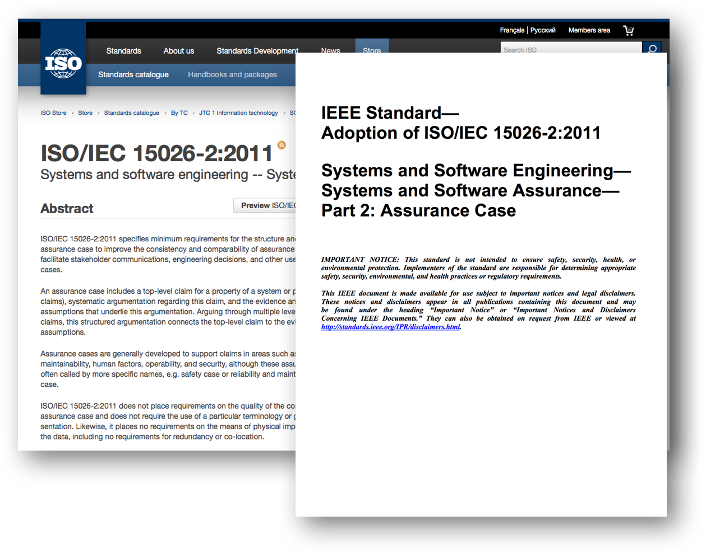

---
# Claims
### Claims concern critical properties

--

### A claim is always worded as a predicate
- i.e. it can only be true or false

--

### Claim should avoid just details about the supporting method/techniques
- .red[Bad claim:] The system uses AES encryption
- Uninteresting

--

### The claim should be a reasonable goal
- .green[Good claim:] “The system is acceptably secure against communication lines related threats”

---
# Claims

## Claim properties are risk-related
- High confidence is needed in their realization

--

## Good Claim Checklist
- .blue[An entity]
- .orange[A critical property of the entity]
- .green[A value for the property and related uncertainty]

--

## Example
- .blue[The system] .green[is acceptably] .orange[secure]
- .blue[The system] .green[has no] .orange[unacceptable consequences to assets from security threats]

---
class: middle
# [Grammatical Guidance](http://www.sei.cmu.edu/dependability/tools/assurancecase/)

## .blue[&lt;NOUN-PHRASE&gt;]
- .blue[Noun-Phrase] identifies the subject (“entity”) of the claim

## .orange[&lt;VERB-PHRASE&gt;]  
- .orange[Verb-Phrase] defines a predicate using the critical property of the subject along with its expected value and related uncertainty

---
class: middle
# [Grammatical Guidance](http://www.sei.cmu.edu/dependability/tools/assurancecase/)

## Bad Examples
- Just describes an entity: ~~.red[XSS results for Canvas]~~
- Describes an action on entity: ~~.red[Perform XSS on Canvas]~~
- A question: ~~.red[How many XSS weaknesses does Canvas have?]~~
- Fact, no argument needed: .red[~~Canvas uses AES encryption~~]

---
class: middle
# .red[Actual] bad examples

## .red[C5: Security Professionals test code for XSS vulnerabilities]

--

## .red[C18: The System uses a Static Analysis tool]
.footnote[
See notes (hit `p`) for class exercise
]
???
# Class exercise:
# Work with your team to rephrase these appropriately.
When you are done enter your answers in this [Google Doc](https://docs.google.com/a/unomaha.edu/document/d/11Xr8GHBHfWJGLotiLoe-us1EZ4Qjn2msjfxHAKjs64Q/edit?usp=sharing)

---

class: middle
# Good Examples

## .blue[Canvas] .green[has no] .orange[exploitable XSS weaknesses]

--

## .green[All] .blue[Canvas XSS weaknesses] .green[have been sufficiently] .orange[mitigated]

--

## .blue[Canvas] .orange[attack surface] .green[is minimized]

---
class: middle
# Scenario

## OPPD NE has received intelligence.
- Rouge nation states are targeting their software supply chains.
- There is a credible threat. Software bought by OPPD for business functions is being targeted for sabotage with malicious code.

--

## Top Level Claim
- .blue[OPPD NE supply chain processes] .green[minimize ] .orange[the possibility of sabotage by malicious code in software applications]

---
class: middle
# Claim Visual Notation
## Based on Goal Structuring Notation (GSN)

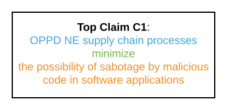

---
class: middle
# Elaborating the Claim

## .green[Additional information] that is excluded from the claim or evidence
- Context (understanding)
- Justification (rationale)
- Assumptions (validity)

---
class: middle
# Context

## Information necessary for a claim to be understood or amplified
- Includes a statement that defines the .red[scope] of the claim
- Provides means to check .red[satisfaction] of the claim

## Examples
- External references, Definitions, Clarification of myths
- Security considerations for supply chain processes per NIST SP 800-160

---
class: middle
# Assumption

## A statement whose validity has to be relied upon in order to make an argument
- .red[Restricted context]
- .red[Exceptions] or situations the claim does not cover

## Example
- Nuclear energy safety mechanisms do not include software

---
class: middle
# Justification

## Provides .red[rationale] for the use/selection of a claim or strategy

## Example
- Intelligence reports of malicious code in nuclear energy software

---
class: middle
# Context Visual Notation

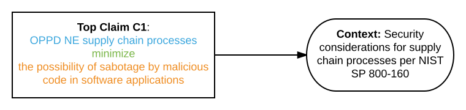

---
class: middle
# Justification Visual Notation

---
class: middle
# Strategy

## Provides direction for an argument

## Phrased with respect to the argument
- .green[Argument by appeal to] software acquisition practices

## A strategy is elaborated by providing a series of sub-claims
---
class: middle
# Strategy Visual Notation

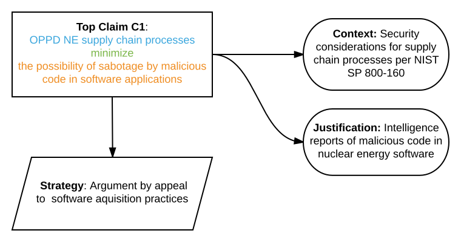

---
class: middle
# Argument

- Conveys why we believe a claim has been met
- Refine claims into sub claims, until the sub-claim can be directly supported by the actual evidence
- Bridges the gap between claims and evidence

--

## Stopping condition?
- The rigor is acceptable
- Resources are unavailable
- Further expenditure is not justified

---

## Sub-claim

Develop a sub-claim

---
## Sub-claim
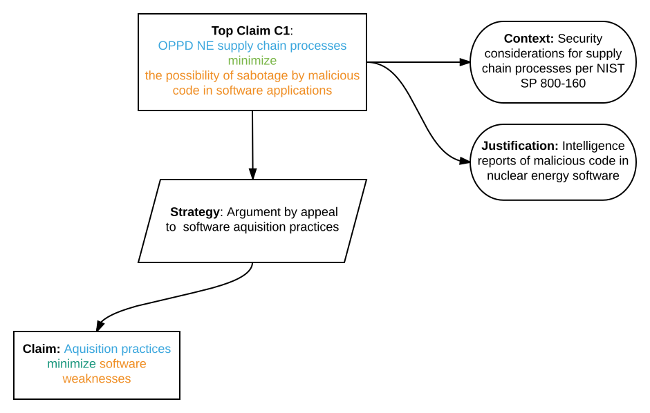

---
class: middle
# Evidence

- Every branch must be terminated in evidence
- Something tangible and measureable

## Grammatical Guidance
- Must be a .blue[noun phrase] only (NO verb phrase)
- Should .red[not] be stated as a claim

---
class: middle
# Evidence

## Examples
- .red[E1:] Test results from penetration tools
- .red[E2:] Warnings from static analysis tool
- .red[E3:] Hardware design review results
- .red[E4:] Parameter validation assurance case
- .red[E5:] Reports for assessing compiler settings with security implications

---
class: middle

---

.topnote[
What do the arrows mean?
]

---
class: center, middle
# Coming up with a good Argument is .large[Hard!]

---

# Eliminative Induction
## Support/assurance increases as reasons for doubt are eliminated

--

## Claim: .blue[The bulb] .green[will] .orange[glow when switched on]
- .red[Unless] switch not connected to light
- .red[Unless] no power
- .red[Unless] dead light bulb  

???
Image and example provided in slides by John B. Goodenough

---
# Introducing Doubts*

## Making doubts explicit
### Attack claim (rebutting defeater) — why claim could be false
--

### Attack evidence (undermining defeater) — why evidence could be irrelevant
--

### .green[Attack inference] (undercutting defeater) — premise good; conclusion uncertain

.footnote[
\*See notes for sources [hit: `p`]
]

???
The content in next few slides is based on:
1. SEI Report: Toward a Theory of Assurance Case Confidence http://www.sei.cmu.edu/reports/12tr002.pdf
2. Charles B. Weinstock, John B. Goodenough, and Ari Z. Klein. 2013. Measuring assurance case confidence using Baconian probabilities. In Proceedings of the 1st International Workshop on Assurance Cases for Software-Intensive Systems (ASSURE '13). IEEE Press, Piscataway, NJ, USA, 7-11.
3. Explicit permission to use slides provided by John B. Goodenough

---
# Assurance Case Logical Structure
## Notice .green[inference rules]?

.footnote[
[Arguing Security - Creating Security Assurance Cases](https://buildsecurityin.us-cert.gov/daisy/bsi/articles/knowledge/assurance/643-BSI.html)
]

---
class: middle
# Inference Rule

## A generalization that in most circumstances is considered to be true

## Example
- (premise) If X is a bird then (conclusion) X can fly

--
- (Generalization) All birds can fly

--

.red[An argument is an instantiation of one or more inference rules with a specific premises and conclusions]

---

# Example Claim
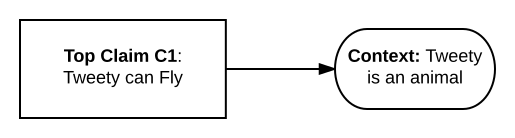

---
# Inference Rule

---

# Undercutting defeater
## Premise good; conclusion uncertain

---

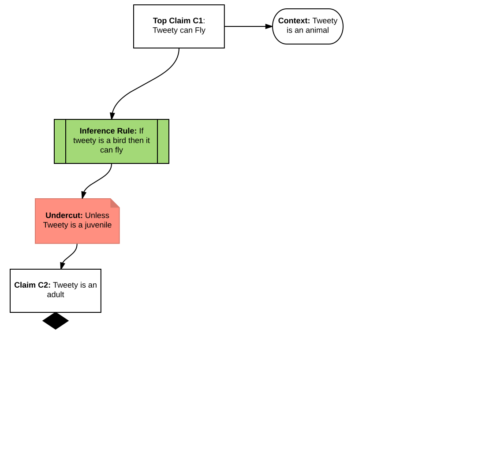

---

# Rebutting defeater
## Why claim could be false

---

# Rebutting defeater
## Why claim could be false
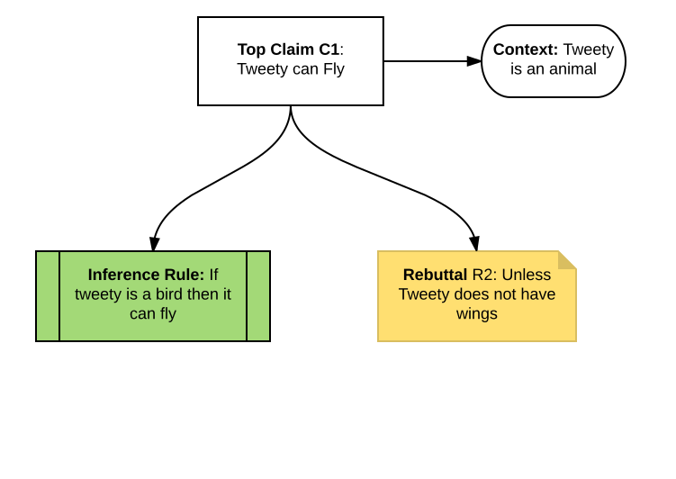

---
# Address Rebutting defeater

---
# Undermining defeater
## Why evidence could be irrelevant
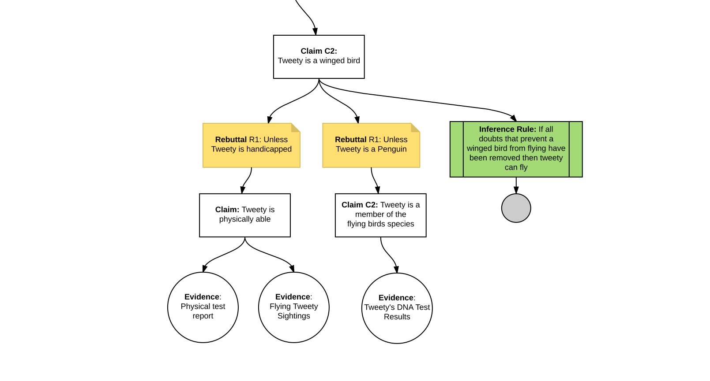

---
# Undermining defeater

---
class: middle
# Measuring Confidence

## Baconinan Probability
- 0|n (no confidence) — no doubts eliminated
- 2|3 (partial confidence) — residual doubt
- n|n (complete confidence) — no doubts remain

--

## Use for relative improvements, not comparison

???
Source: Slides by John B. Goodenough
Source: Charles B. Weinstock, John B. Goodenough, and Ari Z. Klein. 2013. Measuring assurance case confidence using Baconian probabilities. In Proceedings of the 1st International Workshop on Assurance Cases for Software-Intensive Systems (ASSURE '13). IEEE Press, Piscataway, NJ, USA, 7-11.

---
# Few more notations
## Claim to be further developed
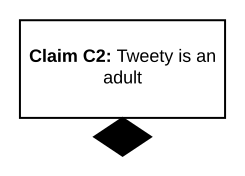

---
# Few more notations
## No further argumentation

---

???
Source: This example is partially based on the presentation of this paper given at ICSE conference: J. B. Goodenough, C. B. Weinstock and A. Z. Klein, "Eliminative induction: A basis for arguing system confidence," 2013 35th International Conference on Software Engineering (ICSE), San Francisco, CA, 2013, pp. 1161-1164.
---

class: middle
# Assurance Cases in Practice

## CC Evaluations and Software Assurance
- Argue how protection profile needs are satisfied by a Security Target
- Assurance cases are recommended for the highest levels of Evaluation Assurance Levels (EAL)

---

class: middle
_In pursuit of Trusted Computer System Evaluation Criteria (TCSEC) or CC evaluations or Federal Information Processing Standard (FIPS) 140-1 or 140-2 certifications for their security-enforcing IT products, vendors are required not only to submit assurance claims for those products to the independent evaluation or certification facility but to .red[provide complete assurance cases] that provide a sufficient basis for the facility to verify those assurance claims.*_

.footnote[
\* [Software Security Assurance State-of-the-Art Report (SOAR)](https://cwe.mitre.org/documents/iatac_swa_soar.pdf), 2007, DoD Information Assurance Technology Analysis Center (IATAC) Data and Analysis Center for Software (DACS)
]
---
class: middle
# Security Controls
[NIST SP 800-53 Rev. 5](https://csrc.nist.gov/csrc/media/publications/sp/800-53/rev-5/draft/documents/sp800-53r5-draft.pdf)

### Makes the security and privacy controls outcome-based
- Focuses on the security and privacy capabilities
- Controls are now .orange[critical properties] of interest.

???
(i.e., what needs to be done to protect the system or information and not which entity carries out the action or where it is carried out);

---
class: middle
# Security Controls
[NIST SP 800-53 Rev. 5](https://csrc.nist.gov/csrc/media/publications/sp/800-53/rev-5/draft/documents/sp800-53r5-draft.pdf)

IA-2 IDENTIFICATION AND AUTHENTICATION
### Current (Rev 4):
- Control: The information system uniquely identifies and authenticates organizational users.

### Proposed (Rev 5):
- Control: Uniquely identify and authenticate organizational users.

---
class: middle
# Software Security Controls
First to develop and apply assurance case based method for control refinement
- Software related controls derived from the NIST SP 800-53 control catalog
- These software assurance controls are enumerated in [NIST SP 800-160 Appendix-J](https://csrc.nist.gov/csrc/media/publications/sp/800-160/archive/2016-05-04/documents/sp800_160_second-draft.pdf)

#### Gandhi, R., Siy, H., Crosby, K., Mandal, S. (Graduate), (2014). Gauging the Impact of FISMA on Software Security, IEEE Computer, vol. 47 (9)
#### Gandhi, R. A., Crosby, K., Siy, H., Mandal, S. (2016) Driving Secure Software Initiatives Using FISMA: Issues and Opportunities. CrossTalk, Journal of Defense Software Engineering, Jan/Feb 2016 Issue.

---
class: middle
# Other Applications

### Forensics
- Jones, C. (2014). __Evaluating the use of assurance cases for digital forensics.__ Dissertations & Theses @ University of Nebraska - Omaha; ProQuest https://search.proquest.com/docview/1528534691?accountid=14692

---
class: middle
# Other Applications

### Research Study Design
- Gandhi R.A. and Lee, S.W., “Assurance Case driven Case Study Design in Requirements Engineering Research,” In: 15th International Working Conference on Requirements Engineering: Foundations for Software Quality, REFSQ 2009.

### Interview Protocol Design
- Gandhi R.A., Germonprez M., Link G., "Open Data Standards for Open Source Software Risk Management Routine: An Examination of SPDX", ACM GROUP 2018 https://github.com/SPDX-CaseStudy/files/blob/master/AssuranceCase.png

---
class: center, middle
# .large[Got Assurance?]
.bottom-left[

]
class: center, middle
# Requirements for Software Security Engineering

---
# Customer Knows Best!\*

.footnote[
\*or do they?
]

---
# Alice must surely know...

---
class: middle
# [NIST SP 800-160 SSE](http://nvlpubs.nist.gov/nistpubs/SpecialPublications/NIST.SP.800-160.pdf)
## .green[Stakeholder Needs and Requirements] Definition Process\*
- **Purpose:** _.red[Define the stakeholder security requirements] that include [protection capability](https://robinagandhi.github.io/swa/slides/lecture-1/systems-security-engineering.html#20), security characteristics, and security-driven constraints for the systems, so as to securely provide the capabilities needed by users and other stakeholders in a defined environment._

.footnote[
\*ISO/IEC/IEEE 15288-2015
]

---
class: middle
# [NIST SP 800-160 SSE](http://nvlpubs.nist.gov/nistpubs/SpecialPublications/NIST.SP.800-160.pdf)
## .green[System Requirements] Definition Process\*
- **Purpose:** _.red[transform the stakeholder security requirements into the system requirements] that reflect a .red[technical security view] of the system._

.footnote[
\*ISO/IEC/IEEE 15288-2015
]

---
class: middle
# .red[Stakeholder] Needs and Requirements

## Litmus test
- Even if you did not build the _software_ the **stakeholder** will still have these needs and requirements!
- They are located in the [environment of operation for the system-of-interest\*](https://robinagandhi.github.io/swa/slides/lecture-1/systems-security-engineering.html#14)

.footnote[
\* Michael Jackson, [The Meaning of Requirements, 1996](http://mcs.open.ac.uk/mj665/aserqts5.pdf)
]

.top-right[

]
---
class: middle
# Need 👉🏼 Fitness for Purpose
## Software is built for a purpose
- It will fail if either:  
1. Designer has inadequate understanding of the purpose  
1. Software is used for a purpose different than originally designed for  

## Inadequate understanding of the purpose leads to poor quality software

???
# When will a designer have inadequate understanding of the purpose?

## Claim: Designer has full understanding of the system purpose
1. Unless the software is too complex i.e. designer does not know for sure if software will fulfill it purpose
1. Unless designer does not have the knowledge or experience
1. Unless the customer does not clearly know the purpose or express it
1. Unless the purpose becomes apparent later.
1. Unless there is a deliberate attempt to make the software not fulfill its purpose
1. ...

---
class: middle
# .red[Use cases] -  OOP, UML
## .blue[Why] and .green[how] and would .orange[someone] use software?
- Goal-driven Scenarios
- They describe system behavior to fulfill user needs
- Several [templates](http://alistair.cockburn.us/Basic+use+case+template) available for [use cases](http://alistair.cockburn.us/Structuring+use+cases+with+goals)  
  .red[Purpose] = build requirements  
  Contents = have consistent prose  
  Plurality = include multiple scenarios per use case  
  Structure = be semi-formal  

.top-right[

]

---

class: middle
# .red[User stories] - Agile, XP, SCRUM
## .blue[How] and .green[why] and would .orange[someone] use software?
- Scenarios
- They are about user needs
- [Informal](https://www.agilealliance.org/glossary/three-cs/), [Card, Conversation and Confirmation](http://ronjeffries.com/xprog/articles/expcardconversationconfirmation/)
.top-right[

]

---

???
Notice the reversed order of Why and How compared to User stories. Use cases are goal-driven for scenario elicitation. On the other hand User stories are scenario driven elicitation technique that link scenarios to goals.
---
class: center, middle
# [What is Requirements Engineering?](http://www.cs.toronto.edu/~sme/RE01/)

.footnote[
See notes (hit `p`) for definition
]

???
# Requirements Engineering
- Requirements Engineering (RE) lies at the heart of software development.
- RE is concerned with identifying the purpose of a software system, and the contexts in which it will be used.
- Hence, RE acts as the bridge between the real world needs of users, customers, and other constituencies affected by a software system, and the capabilities and opportunities afforded by software-intensive technologies.
Source: http://www.cs.toronto.edu/~sme/RE01/

---
class: middle
# Stakeholder Needs and Requirements

## These requirements are about .red[relationships] in the environment of operation
- They are not about the software system
- They are not about the shared interface at the environment of operation and the software system
- They are effects in the environment of operation that the customer wants the software system to guarantee

---
class: middle
# Stakeholder Needs and Requirements

## Expressed in two moods
- .red[Optative]: expresses a wish (R)   
Desired condition over the phenomena of the environment
- .red[Indicative]: expresses things existing in the problem world (D)   
Given properties of the environment

---
class: middle
# System Requirements

## Expressed in a single mood
- .red[Optative]: expresses a wish, Specification (S)  
Desired condition over the shared phenomena at the interface between the system and the environment of operation

???
Based on this definition we are never really describing anything in the system beyond the shared phenomena at the interface of the system and the environment of operation.

---

class: middle
# Problem Frames
Allows focus on `problems` to be solved.

---
class: middle
# Problem Frames
## Frame Diagrams
.left-column[
#### .green[Rectangle with double vertical stripe]: Machine to be developed  
#### .green[Rectangle with single vertical stripe]: Designed domain  
#### .green[Plain rectangles]: Given domains (things that already exist)  
#### .green[Dashed oval]: Requirements  
]
.right-column[

]

???
- Problem frames are described by frame diagrams, which basically consist of rectangles and links between these
- The task is to construct a machine that influences the behavior of the problem domain it is integrated in
---
# Problem Frames
## Frame Diagrams
.left-column[
#### .red[Solid line]: Interfaces that consist of shared phenomena   
#### .red[Dashed line]: A requirements reference to a domain
#### .red[Dashed arrow]: A constraining reference  
]
.right-column[

]

---
class: middle
# Problem Frames

- The machine solves a problem in the application domain (part of the world)
- The machine and the application domain interact at an interface of shared phenomena (events, states)
- The requirement adds a constraint to the application domain’s intrinsic properties or behavior

---
class: middle
# Problem Frame Example

- A PC user wants to analyze the messages in the   
mail client’s mailbox.
- The messages for each correspondent are concatenated  
in one file. The mailfiles are all in one directory
- The analysis report has a specified format, with   
detail lines in order by correspondent name
- The analysis report will also show statistics on volume, size   
and frequency of incoming messages, time taken to reply

.footnote[
Source: Problem Frames, Addison Wesley, 2001
]

---
class: middle
# Context Diagram

.footnote[
Recap: Requirements are about .red[relationships] in the application domain
]

---
# Relationships
.left-column[
Annotation .code[c:D!{E3}] means Domain .code[D] initiates the observable phenomena .code[E3] on interface .code[c].

Example:   
.code[a: MF! {MsgDir, File, Char}]  

Domain .code[MF] initiates observable phenomena .code[MsgDir, File, Char] on interface .code[a]
]
.right-column[

]
---
class: middle
# Frame Components

.left-column[
### .red[R: Requirements]  
What the customer wants to be true in terms of (c, d)

### .red[D: Domain Properties]   
What we know to be true in the domain

### .red[S: Specification]  
How we want the machine to behave at interface (a, b)  
]

.right-column[

]
---
class: middle
# Correctness argument
## S &#x2192; D, R  
- The argument to make:  
_(R)equirements_, _(S)pecifications_ and _(D)omain descriptions_ .red[fit] together

---
# Correctness argument
## Creating (R) is not enough !!
- Creating descriptions of the environment (D) and specification (S) helps our comprehension and provides basis for .red[validating] the requirements

--

## Claim: R is fulfilled
- Unless D or S is Insufficient \*
- Unless D or S is Malicious \*
- Unless D or S is Incorrect \*

.footnote[
\* Eliminative Induction
]
---
class: middle
# Fitness for Purpose: S &#x2192; D, R

## Under constrained behavior
- (S, D) lacks constraints to fulfill (R)  
E.g.: Buffer overflows, Unauthorized physical/network access

--

## Over constrained behavior
- (S, D) includes constraints such that (R) CANNOT be fulfilled  
E.g: 8 char password only, No access allowed

---
class: middle
# Problem Frames

---

class: middle
# How to systematically reason about these issues?
- Solution: Abuse frames

.footnote[
Technical Report No: 2003/10, [Analysing Security Threats and Vulnerabilities Using Abuse Frames](http://mcs.open.ac.uk/mj665/Abuse00.pdf), L.Lin, B.A.Nuseibeh, D.C.Ince, M.Jackson, J.D.Moffett, October 2003
]

---
class: middle
# Abuse Frame

## Abuse argument
- The malicious machine specification (MS), satisfies the vulnerability conditions (v(D)), to achieve the anti-requirement (AR). MS &#x2192; v(D), AR

???
# Example 1:
## M/M: Wireshark
## AS: Network messages
## AT: Rouge ISP
## AR: Targeted Advertising

# Example 2:
## M/M: FBI Website with SQL injection vulnerability  
## AS: Identity Database
## AT: Lulzsec
## AR: Threaten FBI Agents through identity theft

---
# Abuse Frame

## Malicious Machine (M/M)
- Can be assigned to an existing domain, or a domain that is introduced into the problem world in order to reflect that an attacker can utilize the existing domains or other tools (e.g., a virus) that are not originally in the problem world D.

## Vulnerability v(D)
- Conditions in the problem world that combined with the Malicious Machine specification, will satisfy the anti-requirements
- An instance of the problem world that gives rise to an opportunity for attacks

---
class: middle
# Abuse Frame 1 (mailfile example)

## .center[MS &#x2192; v(D), AR]

---

class: middle
# Security Problem Frame

## Correctness argument
- For an attacker (A), the specification of the Security Machine (SM) satisfies the security requirement (SR)  
SM &#x2192; A, SR

---
class: middle
# Security Frame (mailfile example)

---
class: middle
# Comparison
.left-column[
## Abuse Frame

]
.right-column[
## Security Frame

]

---
class: middle
# Iterative Process
## Another Abuse Frame

---
class: middle
# Iterative Process
## Counter with another Security Frame

---

class: middle
# Iterative Process
## Yet another Abuse Frame!

---
# The Design Problem

## What security functions/capabilities exist in the software, i.e. Specification (S), such that given (D), (R) is satisfiable?  
- Security functions (Security Functional Requirements)  
- No exploitable weaknesses (Assurance Requirements)  

## S &#x2192; D, R   
S is resilient to attacks, when D includes an Attacker (A) trying to implement (AR)

---
class: middle
# Functional Security Requirements

## Security functions in the specification (S)   
E.g. Encryption module, access control
## Security constraints on the problem world (D)  
E.g. Controlled physical access, access logs, cleared user base, authorization db

---
class: middle
# Assurance Security Requirements  

## Weaknesses avoided in security functions of the specification (S)     
E.g. Injection, memory issues, weak crypto algorithms or implementation  
E.g. _For openSSL_: Encryption module minimizes exploitable buffer overflow weaknesses to an acceptable level  
## Weaknesses avoided in the problem world (D)  
E.g. password sticky notes, guessable passwords, ad-hoc authorizations, poor clearance processes

---
# More Examples
.left-column[
## Functional
- Access control
- Identification
- Authentication
- Authorization
- Cryptographic APIs
- Sandboxing
- Configuration mgmt.
- Patch and Vuln mgmt.
- Physical Access Control
]
.right-column[
## Assurance
- Input validation
- Exception handling
- TOUTOC
- Resistance to Common attack patterns
- Weak Crypto avoided
- Resistance to Memory issues
- Social Engineering thwarted
]

---
class: middle
# Reflection

## What did we just do?
- Using problem frames we built a bridge from stakeholder requirements to system requirements by identifying the necessary causal chains in the problem world.
- Using abuse and security frames we identify the causal chains and .green[security capabilities and assurances necessary in software] to satisfy the .blue[security requirements of the stakeholder.]

.top-right[

]

---
class: middle
# Abstractions for Security Requirements Elicitation
.top-right[

]
---
class: middle
# Security Requirement Sources
## Security Policies
- Stakeholder Security Needs
- Auditing Needs
- [Certification Needs](http://static1.1.sqspcdn.com/static/f/702523/26767149/1451886707923/201601-Gandhi.pdf?token=l4NhzGQJsXEqUX7CIOwzoK5au%2BM%3D)
- Survivability and Maintainability Needs

## Risk assessment
- Data, Software, Human or Organization, and Physical assets

## Assurance Needs
## Deception Needs
---
class: middle
# Primary elicitation techniques

## 1. Goal-driven approach
- Attacker goal is to violate security expectations
- [Anti-goals](https://www.info.ucl.ac.be/~avl/files/avl-Icse04-AntiGoals.pdf), [Attack Trees](https://www.schneier.com/academic/archives/1999/12/attack_trees.html), [N-SoftGoals](http://citeseerx.ist.psu.edu/viewdoc/download?doi=10.1.1.103.2997&rep=rep1&type=pdf)

--

## 2. Scenario-driven approach
- Negative scenarios (desired future experience, story grounded in real world, thread through a model)
- [Misuse cases](http://www.scenarioplus.org.uk/papers/misuse_cases_ieee_jan_2003.pdf), [Abuse frames](http://mcs.open.ac.uk/mj665/Abuse00.pdf), [Keywords/checklists](https://msdn.microsoft.com/en-us/library/ee823878%28v=cs.20%29.aspx)

--

## 3. Viewpoint-oriented approach
- [Cross-cutting views](http://ieeexplore.ieee.org/stamp/stamp.jsp?arnumber=1048526), [conflicts](http://www.panda.sys.t.u-tokyo.ac.jp/kushiro/ReferencePaper/Requirements%20engineering/00487319.pdf)
- Attacker views, security properties, tradeoffs

---
class: middle
# .red[Use cases] -  OOP, UML
## .green[Why] and .blue[how] would .orange[someone] use software?
- Goal-driven Scenarios
- They describe system behavior to fulfill user needs
- Several [templates](http://alistair.cockburn.us/Basic+use+case+template) available for [use cases](http://alistair.cockburn.us/Structuring+use+cases+with+goals)  
  .red[Purpose] = build requirements  
  Contents = have consistent prose  
  Plurality = include multiple scenarios per use case  
  Structure = be semi-formal  

.top-right[

]

---
class: middle
# Scenarios: UML Use Cases
## Examine concrete scenarios of system use
- Actors and Use Cases
- .red[Associate] actors/users to the use cases
- Relate actors using .red[generalization] and .red[realization]
- Relate use cases using .red[dependencies]
- Use cases have verbs or noun-verb pairs in it

---
class: middle
# Use Case Diagram

---
class: middle
# Use Case Diagram

## Relationships

.left-column[

]
.right-column[

]
---
class: middle
# Use Case Diagram

.left-column[

]
---
class: middle
# Mis Use Case Diagram

## Misuser
An actor that initiates misuse cases, either intentionally or inadvertently.

--

## Misuse Case
A sequence of actions, including variants, that a system or other entity can perform, interacting with misusers of the entity and causing harm to some stakeholder if the sequence is allowed to complete

Extension to the UML use cases modeling language
---
class: middle
# Misuse Case Diagram

---
class: middle
# Misuse Case Diagram

---
class: middle
# Misuse Case Diagram

---
class: middle
# Misuse Case Diagram

---
class: middle
# Misuse Case Diagram

---
class: middle
# Misuse Case
## Construction Steps
### Step 1
Include normal actors and the required use cases regardless of any security considerations
### Step 2
Introduce the major mis-actors and misuse cases, i.e., threats that are reasonably likely. Name should give a clear understanding of motivation

---
class: middle
# Misuse Case
## Construction Steps
### Step 3
Investigate the potential relations between misuse cases and use cases, especially in terms of potential “includes”-relations. Many threats can realized by a system’s normal functionality. E.g. denial of service, covert channels, sql injection
### Step 4
Introduce new use cases with the purpose to detect or prevent misuse cases

---
class: middle
# Misuse Case
## Construction Steps
### Step 5
Make a detailed requirements [documentation](http://citeseerx.ist.psu.edu/viewdoc/download?doi=10.1.1.9.8190&rep=rep1&type=pdf)

???
We will not do this step to keep the process lightweight. But you know how to do it if required.

---

class: middle
# Requirements and Risk

---
class: middle
# Risk

???
This is the language of risk. Goals, Scenarios and viewpoints are the language of requirements. However our understanding always lacks an explicit traceability from the security requirements to the risk components. By building abuse and misuse models we make this relationship explicit.

---
class: middle
# The Design Activity

???
A model that helps to understanding security requirements in terms of related risk components is absolutely necessary. It can establish the necessity and sufficiency of security requirements in the given context.

---

class: middle, center
# Questions?

---

class: center, middle
# Misuse Case Exercise

---
class: middle

### _Skip this step if you already have a Lucidchart account._

# Step 1
## Create an account on [Lucidchart](https://www.lucidchart.com/) using your `.edu` email
- OR Request an upgrade here: https://www.lucidchart.com/pages/usecase/education-request

---

class: middle
# Step 2
## Recall the assurance case assignment
- You picked 5 claims related to your project and built assurance cases for each.

---
class: middle
# Step 3
## Elaborate the top 5 claims using Misuse cases
- Contextualize the security function or security weakness addressed in your assurance cases
- Use misuse cases to elaborated on additional security functions

## Click on this [template](https://www.lucidchart.com/invitations/accept/59a6e092-49bd-4af3-80be-a1f0862923e5) to start a new misuse case

---
class: middle
# Step 4
## Submit links to your misuse cases developed in Lucidchart
- Submission of the links on Canvas
- One submission per team
- Clearly indicate which claims are elaborated by which misuse cases

---
# Grading criteria

## Use of proper notations
- Misuse case notation

## Argument Quality
- Misuse cases help elaborate additional security functions related to the top 5 claims

## Due Date
.red[Friday, October 6th, 2017]

---
# Generating shareable links on Lucidchart

---
class: middle
# Resources
1.	These slides!
1.	Reading on Mis-use case
1.	The [Common Attack Pattern Enumeration and Classification (CAPEC)](http://capec.mitre.org/data/graphs/1000.html) as a reference for common attacks
